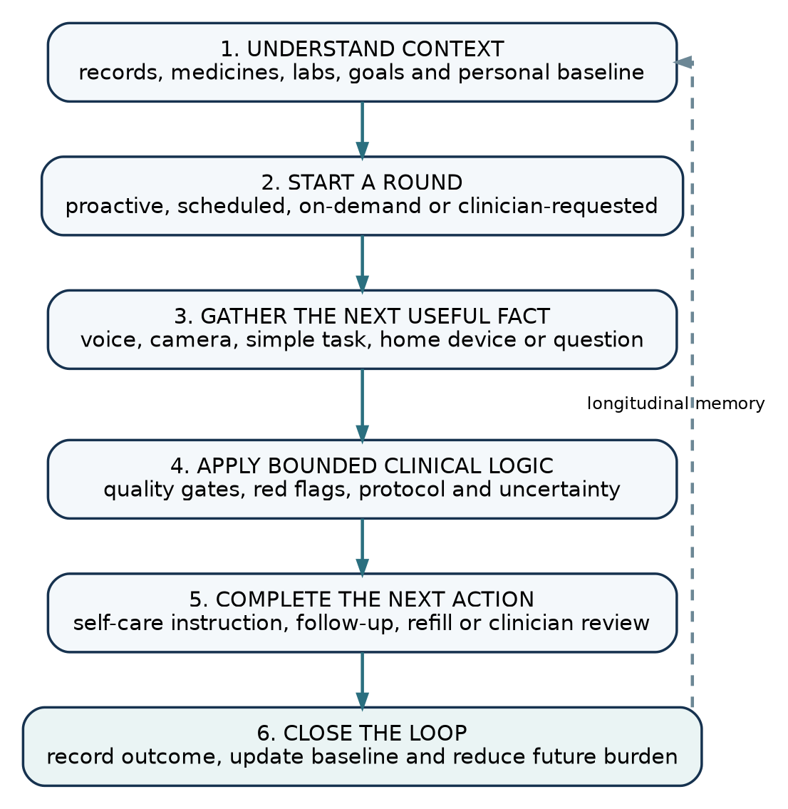
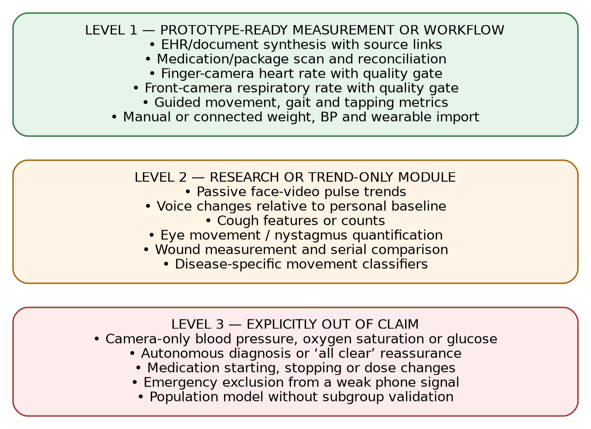
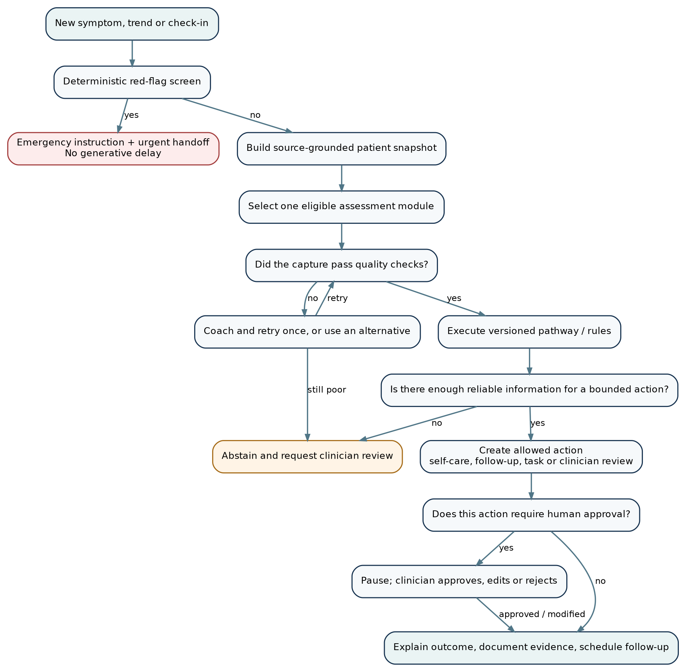
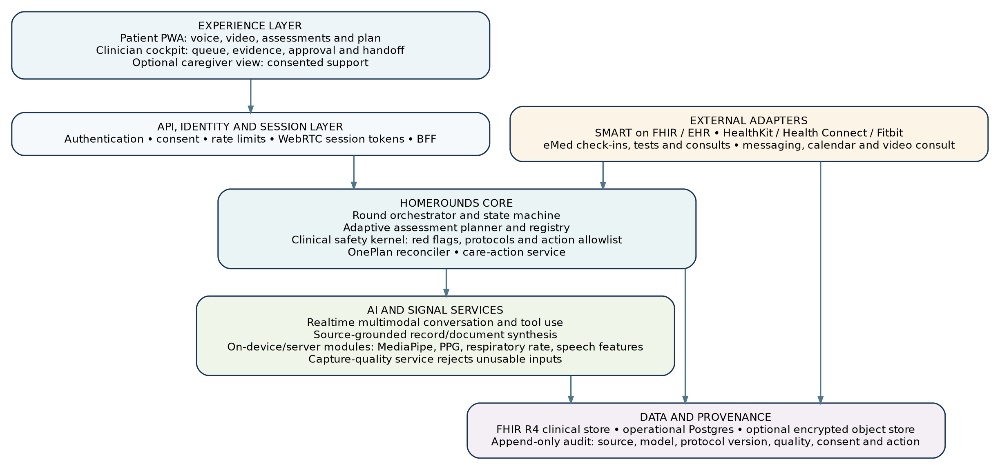
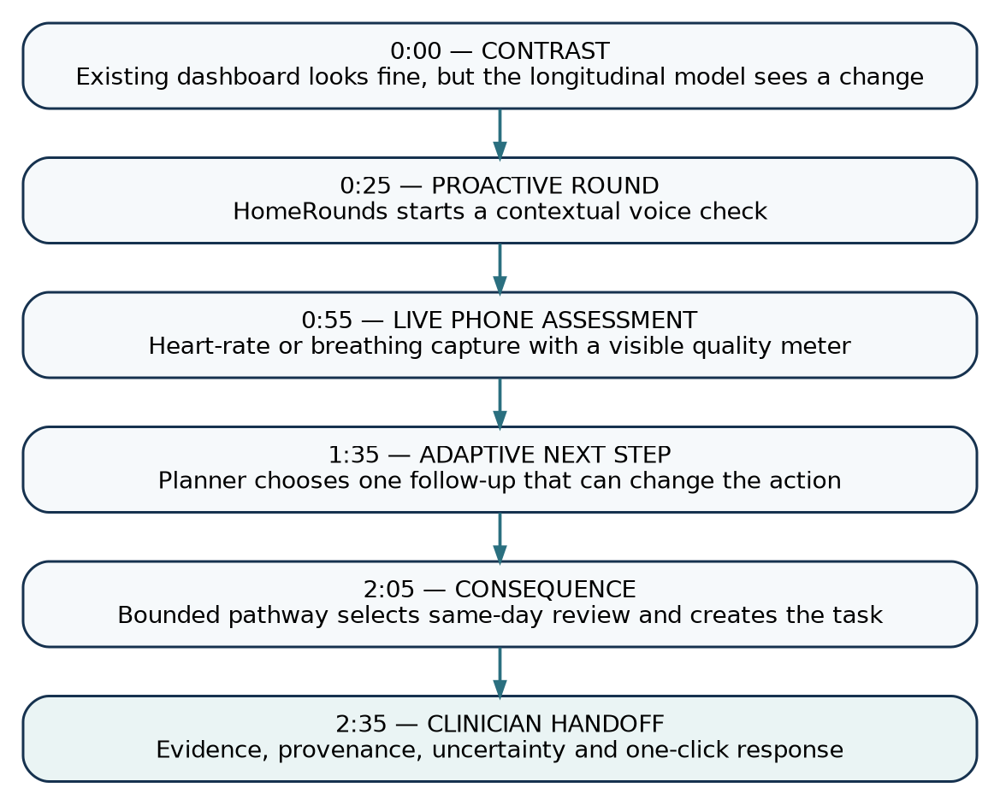

> **Document status:** v0.9 — hackathon-ready product and engineering specification.  
> **Working name:** HomeRounds. A naming and trademark check is required before external launch.  
> **Primary audience:** product, clinical, design and engineering team; Claude Code/Codex implementation agents; hackathon judges and mentors.  
> **Safety note:** this document is a product specification, not clinical guidance. All prototype data should be synthetic or explicitly de-identified. The prototype must not present itself as a substitute for emergency services or a licensed clinician.

# Executive recommendation

HomeRounds should be built as a **software-first, phone-accessible, adaptive home assessment and care-orchestration product**. It should not be presented as a symptom checker, a generic health chatbot, a passive remote-monitoring dashboard, or a system that claims to diagnose disease from a phone camera.

The product thesis is:

> **HomeRounds gives every patient a clinically bounded, longitudinal health agent that knows their records, notices meaningful change, gathers the next useful piece of evidence through the phone, and completes the safest next care action with the clinical team.**

A “round” is a short, purposeful assessment episode. It can begin proactively when the system detects a relevant change, on demand when the patient feels different, on a schedule, or at a clinician’s request. The system assembles the patient’s relevant history, uses a small library of approved multimodal assessment modules, applies deterministic safety and pathway rules, and closes the loop with a clear patient instruction and an auditable clinician handoff.

This framing is intentionally narrower and safer than “personal AI doctor,” but more complete than “AI coach.” It combines four products that would otherwise feel fragmented:

1. **Longitudinal clinical memory** — EHR/FHIR records, laboratory results, medicines, care plans, prior rounds, home measurements and optional wearable data.
2. **Adaptive home assessment** — voice, camera, simple guided tasks, document/medicine scanning, questionnaires and connected-device inputs selected only when useful.
3. **OnePlan** — reconciliation and simplification of medicines, instructions, appointments and care-plan obligations.
4. **Care execution** — clinician review tasks, follow-up scheduling, messages, refills, home-test requests and escalation, all inside an action allowlist.

The event gives teams a roughly twenty-hour build window, from Friday evening to 15:00 on Saturday, and scores user impact, innovation, feasibility and demo quality [R01]. The correct hackathon strategy is therefore **one complete vertical slice** rather than a broad but simulated platform:

- A synthetic patient with obesity/type 2 diabetes and cardiovascular comorbidity.
- A proactive round triggered by a meaningful longitudinal change.
- A real-time voice interaction.
- One real phone-camera measurement with a visible quality meter.
- One dynamically selected follow-up assessment.
- A deterministic pathway decision.
- A real clinician task and evidence card in a second interface.

The strongest three-minute story is:

> “The ordinary dashboard still looks acceptable. HomeRounds notices that this patient is changing, conducts the right five-minute home round, and gives the clinician the evidence needed to act — without making the patient book a live appointment first.”

{width=100%}

# 1. Context and strategic fit

## 1.1 Hackathon brief

The challenge asks for the next generation of AI-powered at-home chronic-condition management, particularly for obesity, type 2 diabetes and cardiovascular disease. It calls out inadequate home biomarker interpretation, long-term support, complex needs such as heart and women’s health, asynchronous connection with clinical teams, and the conversion of complex health data into simple action. The organisers explicitly reject incremental improvements to existing apps and prioritise a working live demo over slides [R01].

HomeRounds fits that brief because it changes the unit of care from a scheduled appointment or a passive alert to an **adaptive asynchronous clinical round**. The product does not simply collect more data. It decides which low-burden evidence is worth collecting, verifies whether that evidence is usable, and routes the patient into a bounded action.

## 1.2 What eMed already does

eMed is already a hybrid clinical and digital-care platform. Its public programmes include app-based onboarding, at-home blood collection, clinician review, weekly weight capture, medication scanning, side-effect reporting, refill questionnaires, messaging, 24/7 support and patient/employer dashboards [R02–R05]. Its public site describes the core proposition as “clinical care, at-home diagnostics, one app” [R02].

HomeRounds must therefore **extend rather than reproduce** the existing eMed experience. It should not be another weekly check-in, reminder, symptom-report form or biomarker dashboard. The additive layer is:

- assembling the right context automatically;
- deciding whether a round is warranted;
- choosing the next most useful home assessment;
- checking capture quality;
- reconciling the result with the patient’s plan;
- generating one actionable, source-grounded clinician handoff;
- learning which checks can be omitted next time.

Where eMed provides the clinical programme, tests, medication operations and human care team, HomeRounds becomes the **adaptive intelligence and orchestration layer**.

## 1.3 Why the product can exist now

The individual components are not all new. FHIR, remote monitoring, pose estimation and smartphone photoplethysmography have existed for years. The “could not have existed two years ago” innovation is the practical combination of:

- real-time multimodal language models that can converse, see, use tools and handle interruptions;
- reliable structured output and tool schemas;
- browser- or device-side computer vision and signal processing;
- increasingly accessible FHIR records and consumer health data;
- agent workflows that can pause for approval and resume;
- a protocol-bound planner that asks only for information that can change the next action.

The OpenAI Agents SDK now exposes tools, Zod-backed validation, guardrails, sessions, tracing, realtime voice and human-in-the-loop approval patterns [R34–R36]. SMART App Launch 2.2 and FHIR R4 provide a standard route into clinical records [R29–R30]. Apple HealthKit can expose user-authorised FHIR clinical records, while Android Health Connect is adding experimental FHIR-based medical-record support [R31–R32]. These capabilities make the integration plausible; they do not remove the need for clinical validation.

## 1.4 Product category

HomeRounds is best described as:

> **Adaptive asynchronous clinical assessment and care orchestration for people managing long-term conditions at home.**

It is not:

- a replacement for emergency care;
- an autonomous diagnosing system;
- an unrestricted general medical chatbot;
- continuous surveillance of the patient;
- a new hardware device;
- a generic remote-patient-monitoring dashboard;
- a consumer wellness app that optimises engagement rather than care.

# 2. Product vision

## 2.1 Blue-sky vision

In the blue-sky state, every patient has an **always-available clinical memory, not always-on surveillance**. HomeRounds understands the patient’s diagnoses, medicines, past results, programme obligations, preferences, health literacy, accessibility needs and personal baseline. It watches only consented data streams and acts only when a change is both meaningful and actionable.

When the patient says “I feel different,” the product does not begin from a blank chat box. It starts with a structured patient snapshot and a clinical purpose. It may ask a question, request a 30-second camera measurement, guide a short movement task, inspect a medicine package, import a connected-device value or ask the patient to complete an existing eMed home test. It stops as soon as it has enough reliable information to select a safe next step.

The system then:

- explains what it noticed in plain language;
- distinguishes a measurement from an interpretation;
- tells the patient what to do now;
- creates a clinician review when appropriate;
- sends the clinician the facts, sources, trends, capture quality and pathway rule;
- updates the longitudinal record and schedules the next check.

The long-term ambition is a network of condition-specific “round packs” — for example cardiometabolic care, GLP-1 treatment, heart failure, hypertension, post-discharge recovery, diabetes foot monitoring, women’s health and respiratory disease — all running on the same safety, data and workflow substrate.

## 2.2 Product principles

1. **A round has a purpose and a stop condition.** The system is not rewarded for asking more questions.
2. **Personal change beats population novelty.** Many early phone biomarkers are more defensible as within-person trends than one-off diagnoses.
3. **No signal without a quality score.** A measurement that fails capture-quality checks is not converted into a clinical conclusion.
4. **The model may propose; the safety kernel disposes.** Generative AI handles conversation, synthesis and candidate planning. Versioned rules determine allowed actions.
5. **One clear patient action.** The patient should not receive a differential diagnosis dump or a long task list.
6. **Evidence before explanation.** Every clinician-facing statement links to source data, assessment method, timestamp and confidence/quality.
7. **Human oversight is a product feature.** High-impact actions pause for clinician approval rather than hiding the human in the small print.
8. **Minimum necessary data.** Prefer on-device processing, derived measurements and short retention periods over storing raw audio/video.
9. **Accessible by default.** Voice, text, captions, large touch targets, language support, low-bandwidth fallbacks and caregiver assistance are first-class.
10. **No silent scope expansion.** Each new condition, assessment module or clinical claim is versioned and separately validated.

## 2.3 Working intended-use statement

For planning purposes, the initial intended use should be deliberately bounded:

> HomeRounds is intended to help adults enrolled in a clinician-supervised chronic-care programme collect and organise relevant symptoms, records and selected home measurements; identify when predefined review criteria are met; and communicate a structured summary to the care team. It is not intended to independently diagnose a condition, rule out an emergency, or initiate, stop or change prescription medication without clinician review.

This wording is not a final regulatory determination. In the UK, software used for medical purposes can fall within medical-device regulation, and the MHRA emphasises that intended purpose must be specific about population, user, setting and how output affects a care pathway [R44–R46].

# 3. Users and jobs to be done

## 3.1 Primary patient

**Profile:** an adult managing one or more chronic conditions at home, possibly taking GLP-1 medication, antihypertensives, diabetes medicines or heart medicines. They may have variable health literacy, limited time, anxiety about symptoms, or difficulty obtaining frequent appointments.

**Jobs:**

- “Tell me whether this change is worth acting on without making me interpret all my data.”
- “Ask me only what matters.”
- “Help me complete the right check correctly.”
- “Give me one understandable next step.”
- “Make sure my clinical team gets the important information without me retelling my history.”
- “Keep my medicines, appointments and instructions in one coherent plan.”

## 3.2 Clinician or clinical operations user

**Profile:** nurse, pharmacist, doctor or trained clinical operations professional reviewing asynchronous cases across a programme.

**Jobs:**

- “Show me the patients who need attention, not everyone who produced an abnormal number.”
- “Give me enough evidence to act quickly.”
- “Show where every fact came from and whether the input was usable.”
- “Let me approve, modify or reject the proposed next step.”
- “Document the interaction automatically without inventing facts.”
- “Reduce repeated history-taking and fragmented messages.”

## 3.3 Caregiver or family supporter

**Profile:** an explicitly authorised family member or caregiver.

**Jobs:**

- receive only the tasks the patient has consented to share;
- help position the phone or complete a test;
- know when to assist without receiving unrestricted clinical data;
- avoid becoming a substitute for the clinical team.

## 3.4 Programme operator / eMed

**Jobs:**

- improve continuity and safety between scheduled touchpoints;
- reduce avoidable clinician workload and non-actionable alerts;
- extend existing home testing and check-in infrastructure;
- increase adherence through problem resolution rather than reminders alone;
- create an auditable, configurable pathway platform across conditions.

# 4. Core product model

## 4.1 What is a round?

A round is a bounded state machine with six phases:

1. **Trigger** — why the episode started.
2. **Context** — the minimum relevant longitudinal snapshot.
3. **Assessment** — one or more approved data-gathering steps, chosen sequentially.
4. **Decision** — quality checks, red flags and protocol logic.
5. **Action** — a permitted patient or clinical workflow.
6. **Closure** — explanation, documentation, follow-up and learning.

A round ends when one of the following occurs:

- an emergency instruction is delivered;
- a predefined action threshold is met;
- the patient declines or cannot complete the assessment;
- capture quality remains inadequate;
- the planner reaches its burden/time budget;
- the system abstains and requests clinician review;
- the patient’s question is resolved inside a low-risk self-management pathway.

## 4.2 Round types

| Round type                | Trigger                                   | Typical purpose                                    | Example                                                                               |
| ------------------------- | ----------------------------------------- | -------------------------------------------------- | ------------------------------------------------------------------------------------- |
| Proactive                 | a clinically relevant longitudinal change | gather missing evidence before creating an alert   | rising resting heart rate plus falling activity prompts a brief cardiometabolic round |
| On demand                 | patient opens the app or speaks a concern | understand a new symptom or practical problem      | “I feel more breathless today”                                                        |
| Scheduled                 | care-plan timetable                       | replace a fixed questionnaire with an adaptive one | weekly GLP-1 review asks only the questions relevant to this patient                  |
| Clinician initiated       | clinician sends a task                    | collect a standardised assessment asynchronously   | repeat breathing rate and medicine scan before review                                 |
| Follow-up                 | previous round action                     | verify that a plan worked or symptoms changed      | repeat assessment 24 hours after advice                                               |
| Recovery / post-discharge | time since discharge or procedure         | detect recovery drift and coordinate care          | daily low-burden round after admission                                                |

## 4.3 Longitudinal health graph

The product maintains a source-grounded patient model. “Graph” here means a structured relationship layer, not a promise that a graph database is required.

The model includes:

- diagnoses and relevant historical episodes;
- current and recently changed medicines;
- allergies and contraindications;
- laboratory and diagnostic results;
- care plans, goals and programme obligations;
- appointments, referrals and open tasks;
- patient-reported symptoms and preferences;
- home measurements and wearable-derived trends;
- prior rounds, actions and outcomes;
- personal baselines and data-quality history;
- consent, access and caregiver relationships.

FHIR resources remain the clinical source of truth where available. Derived features are stored separately with explicit provenance. Vector retrieval may index unstructured documents, but the vector store must never become the authoritative medication or laboratory record.

# 5. End-to-end user journeys

## 5.1 Proactive cardiometabolic round — hero journey

**Scenario:** Maya is enrolled in a chronic-care programme for obesity and type 2 diabetes and also has hypertension and a history of heart failure. Her ordinary weekly dashboard still looks acceptable. HomeRounds detects a combination of consented changes: lower activity, a higher resting heart-rate trend, a small weight increase and a missed medicine refill.

1. The trigger engine calculates that the pattern is worth a round but not enough for an alert.
2. Maya receives: “A few of your recent trends changed together. Can we do a two-minute check?”
3. Before the generative model responds, the red-flag screen checks for emergency symptoms.
4. The realtime agent confirms the concern by voice and asks one targeted question.
5. The planner chooses a front-camera breathing-rate measurement because it can change the pathway and is feasible on Maya’s device.
6. The capture screen shows positioning, lighting, motion and elapsed-time quality in real time.
7. If quality passes, the result is compared with Maya’s baseline, not treated as a diagnosis.
8. The planner requests a medicine-package scan because the refill data are incomplete.
9. The protocol engine matches a same-day clinical-review rule.
10. The action service creates a clinician task, attaches an evidence card and gives Maya one instruction plus clear worsening/emergency guidance.
11. The clinician sees the trend, measurements, source documents, protocol version and a one-click approve/message/schedule interface.
12. The round closes only after the patient receives a confirmed next step.

## 5.2 On-demand side-effect round

A patient says, “I am nauseous and cannot keep doing this.” HomeRounds:

- screens for predefined red flags;
- checks medication, dose, timing, recent changes and prior side effects;
- asks the minimum questions needed by the approved side-effect pathway;
- distinguishes a practical problem from a safety issue;
- can request a medicine scan or hydration/food history;
- does not independently change the GLP-1 dose;
- creates a clinician review, approved self-care instructions or a refill/delivery task;
- updates OnePlan so the patient is not left with conflicting instructions.

## 5.3 Function assessment as a module, not a product

When weakness, falls, reduced activity or functional decline is relevant, the planner may select a movement module. The patient performs a brief task such as chair rises, a short walk, balance stance or hand tapping. The app measures time, cadence, symmetry and range of motion using the phone camera. The result is useful because it is linked to a specific clinical question and personal baseline, not because chair rises are a standalone product.

## 5.4 OnePlan reconciliation

When records, medicines or instructions conflict, OnePlan:

1. extracts structured obligations from FHIR resources and uploaded documents;
2. links each instruction to its source;
3. normalises medicine names, timing and units;
4. detects duplicates, omissions, expired instructions and schedule collisions;
5. distinguishes a factual conflict from a preference trade-off;
6. asks a clinician only the question that cannot be safely resolved;
7. produces one patient-facing plan after approval;
8. writes the resolution and provenance back to the record.

OnePlan is a cross-cutting feature used during rounds, not a separate consumer app.

# 6. Functional requirements

## 6.1 Patient experience

### FR-P01 — Home and today view

The patient home screen shall show:

- the next required action;
- active round invitations;
- a simple “What changed?” summary;
- upcoming medicines/check-ins/appointments;
- a prominent “I feel different” entry point;
- emergency guidance that is always reachable;
- data-connection status and consent controls.

### FR-P02 — Realtime multimodal round

The patient shall be able to complete a round by voice or text. The interface shall:

- support interruption and clarification;
- display a live transcript and captions;
- show why each question or assessment is being requested;
- keep the active task visually dominant;
- never expose raw chain-of-thought;
- allow the patient to stop, skip or request human help;
- maintain a visible timer and expected remaining burden.

### FR-P03 — Assessment capture

Each assessment module shall provide:

- eligibility and contraindication checks;
- clear preparation and positioning instructions;
- live capture-quality feedback;
- a progress indicator;
- a retry and alternative path;
- an explanation of what is and is not being measured;
- a structured result and quality score;
- consent and retention controls for raw media.

### FR-P04 — Outcome card

At the end of a round, the patient shall receive:

- one urgency label in plain language;
- one primary next action;
- what the system noticed, without diagnosing beyond scope;
- what will happen next and by when;
- clear instructions for worsening symptoms;
- a way to contact the clinical team;
- a record of any task, appointment or message created.

### FR-P05 — Records and plan

The patient shall be able to view:

- medicines and the source of each medicine record;
- recent laboratory results in plain language;
- care-plan tasks and appointments;
- open clinician requests;
- prior round summaries;
- connected data sources;
- errors or unresolved conflicts requiring review.

## 6.2 Trigger and monitoring engine

### FR-T01 — Trigger catalogue

The system shall support triggers from:

- patient-reported concerns;
- scheduled care-plan events;
- missed high-value actions;
- medication or refill events;
- laboratory or home-test results;
- single measurements that cross a configured safety threshold;
- multivariate trend changes relative to personal baseline;
- clinician requests;
- post-discharge schedules.

### FR-T02 — Alert budget

The trigger engine shall not convert every anomaly into a patient or clinician alert. It shall:

- deduplicate related triggers;
- combine weak signals into one episode;
- require action relevance before starting a proactive round;
- enforce patient and clinician burden budgets;
- suppress repeated alerts when an action is already open;
- record why a trigger was suppressed or promoted.

Remote monitoring can create non-actionable workload, and recent evidence links alert fatigue with reduced escalation behaviour; a recent randomised trial also found that generic post-acute monitoring did not improve outcomes and worsened some outcomes in older adults [R18–R20]. HomeRounds therefore optimises for **actionable rounds**, not maximum data capture.

### FR-T03 — Personal baseline

The system shall support rolling and clinically anchored baselines. A baseline record shall include:

- measurement definition and device/method;
- time window and number of valid observations;
- within-person variability;
- context such as time of day, medication phase or recovery state;
- subgroup and device limitations;
- the latest baseline recalculation timestamp and algorithm version.

## 6.3 Adaptive assessment planner

### FR-A01 — Candidate module selection

The planner shall select only from an approved assessment registry. It shall score each candidate using:

- whether the result can change the next permitted action;
- expected information gain;
- patient burden and accessibility;
- device capability and prior capture success;
- contraindications and pathway eligibility;
- time sensitivity;
- evidence level;
- risk of false reassurance or false escalation.

A conceptual scoring function is:

`score = action_relevance × expected_information_gain × reliability − burden − capture_failure_risk − clinical_risk`

For the hackathon MVP this shall be implemented as an explicit, testable scoring table. A language model may summarise the rationale but shall not invent new modules or weights.

### FR-A02 — Sequential questioning

The planner shall request at most one next assessment at a time and update the patient state after each result. It shall stop when:

- a protocol action threshold is met;
- no eligible assessment has positive expected value;
- the round burden limit is reached;
- the system cannot determine a safe next step;
- the patient declines.

Research on interactive clinical question asking shows that simply prompting an LLM to ask more questions can reduce performance; abstention and explicit question policies are necessary [R16]. Adaptive questionnaires can substantially reduce the amount of information users must enter when the question flow is derived from clinical rules [R17].

### FR-A03 — Abstention

The planner shall return `abstain=true` when information is incomplete, contradictory, low quality or outside the protocol. Abstention shall create a clinician-review path rather than a generic failure message.

## 6.4 Clinical safety kernel

### FR-S01 — Deterministic red-flag screen

A versioned red-flag function shall run:

- when a round starts;
- after every new symptom report;
- after every assessment result;
- immediately before closure.

Red-flag logic shall be clinician-authored and independently testable. It shall not depend on the generative model correctly remembering emergency criteria.

### FR-S02 — Protocol execution

Each pathway shall have:

- an identifier and semantic version;
- intended population and exclusions;
- required facts and permitted substitutes;
- red flags;
- decision rules;
- allowed actions;
- approval requirements;
- patient-message templates;
- evidence and clinical owner;
- expiry/review date.

The MVP can use JSON/YAML rules validated with Zod. A production system can execute CQL/FHIR PlanDefinition where appropriate; the open-source CQL execution framework supports JavaScript/TypeScript execution but has documented implementation gaps and should not be adopted blindly [R42].

### FR-S03 — Action allowlist

The AI may call only pre-registered tools. Suggested action classes:

- record a patient report;
- request or repeat an approved assessment;
- show approved self-management content;
- send a non-urgent message;
- create a clinician-review task;
- schedule or request a follow-up;
- initiate an existing refill workflow;
- request an existing home-test workflow;
- deliver emergency guidance.

The following shall require explicit clinician approval in the initial product:

- medication changes;
- diagnostic labels;
- altering a formal care plan;
- delaying or cancelling a clinical review;
- any action that materially changes access to care.

### FR-S04 — Provenance and audit

Every material output shall record:

- patient and round identifiers;
- input sources and timestamps;
- raw and normalised measurement references;
- capture-quality result;
- protocol and rule version;
- model and prompt/configuration version;
- tool calls and responses;
- human approvals or edits;
- patient-facing message;
- final action and closure state.

## 6.5 OnePlan

### FR-O01 — Extraction and normalisation

OnePlan shall extract medicines, doses, timing, appointments, tests, goals and behavioural instructions from FHIR resources and uploaded clinical documents. Each item shall retain a source pointer and extraction confidence.

### FR-O02 — Conflict detection

The system shall detect:

- duplicate medicine entries;
- inconsistent names, doses or schedules;
- expired or superseded instructions;
- uncompleted monitoring requirements;
- conflicting appointment or test instructions;
- care-plan tasks that cannot all be completed within the patient’s stated constraints;
- factual conflicts between a document and the current EHR record.

### FR-O03 — Resolution

The system may automatically resolve formatting and source-priority issues defined by policy. Clinical ambiguity shall be routed to a clinician with one focused question. The patient-facing plan shall not change until approval is recorded.

## 6.6 Clinician cockpit

### FR-C01 — Prioritised queue

The queue shall rank rounds by:

- urgency category;
- potential preventable harm;
- time since trigger;
- unresolved red flags;
- patient vulnerability and programme rules;
- whether a safe interim action exists;
- clinician workload and routing rules.

It shall not rank by opaque model score alone.

### FR-C02 — Evidence card

The review screen shall show:

- one-sentence reason for review;
- patient’s relevant conditions and medicines;
- longitudinal trend visualisation;
- the patient’s own words and transcript excerpt;
- assessment results and capture quality;
- protocol rule that fired;
- missing or conflicting information;
- proposed action;
- source links and timestamps;
- an explicit “AI-generated; verify” label where appropriate.

### FR-C03 — Actions

The clinician shall be able to:

- approve, edit or reject a proposal;
- send a templated or free-text message;
- request another approved assessment;
- schedule a live consultation;
- close the round with a reason;
- update the formal care plan;
- flag a data-quality or safety issue;
- create a follow-up trigger.

### FR-C04 — Documentation

The system shall generate a structured note from recorded facts. The note shall distinguish:

- patient-reported facts;
- imported record facts;
- measured observations;
- model-generated summaries;
- clinician decisions.

No information absent from the sources shall be presented as fact. Clinical LLM studies demonstrate overconfidence, fabricated elaboration and prompt sensitivity; prompt engineering alone does not eliminate these problems [R21–R24].

# 7. Multimodal assessment registry

## 7.1 Registry design

Every module is a versioned product object, not merely a prompt. An `AssessmentDefinition` shall include:

- module identifier and version;
- patient-facing name;
- clinical question it can help answer;
- intended population and exclusions;
- required sensors and device capabilities;
- preparation and capture instructions;
- processing location: on device, server or vendor SDK;
- output schema and units;
- quality metrics and acceptance threshold;
- evidence level;
- known subgroup/device limitations;
- permitted pathway uses;
- retention requirements;
- validation dataset and owner;
- regulatory claim boundary.

{width=100%}

## 7.2 Evidence Level 1 — prototype-ready measurements and workflows

These modules are sufficiently understandable and implementable to appear in a prototype, provided they are quality-gated and framed as measurements or workflow inputs rather than diagnoses.

### 7.2.1 EHR and document synthesis

**Input:** FHIR resources, clinical letters, laboratory PDFs and prior notes.  
**Output:** structured patient snapshot, care obligations and source-linked summary.  
**MVP:** yes.  
**Boundary:** extraction and summarisation must be schema-validated and source-linked; medicine facts should be reconciled against the structured record.

### 7.2.2 Medication package and QR/barcode scan

**Input:** phone image or barcode/QR.  
**Output:** product name, dose/strength, package identifier, expiry where visible, match/mismatch against MedicationRequest.  
**MVP:** yes. eMed already uses medication scanning in weekly check-ins, so the innovation is the adaptive reason for requesting it and the reconciliation/action that follows [R03].  
**Boundary:** visual extraction is not proof that a medicine was taken.

### 7.2.3 Finger-camera heart rate

**Input:** 20–30 seconds of rear-camera video with a finger covering the lens; torch where supported.  
**Output:** heart rate, signal-quality score and method metadata.  
**MVP:** preferred live module.  
**Evidence:** a prospective study of 95 participants reported mean absolute percentage error of 1.6% for heart rate under its protocol and did not find significant error differences across measured skin-tone subgroups [R06].  
**Boundary:** this is not ECG rhythm diagnosis, oxygen saturation or blood pressure.

**Implementation outline:**

1. sample mean RGB intensity in a stable region of interest;
2. reject frames with saturation, coverage loss or motion;
3. detrend and band-pass the signal to a plausible heart-rate band;
4. estimate periodicity with autocorrelation and/or FFT;
5. compare estimators and calculate a signal-quality index;
6. return a value only when the quality threshold and recording duration are met.

### 7.2.4 Front-camera respiratory rate

**Input:** seated front-camera video with upper torso visible.  
**Output:** breaths per minute, signal-quality score and capture context.  
**MVP:** possible hero or secondary module.  
**Evidence:** the same prospective validation study reported mean absolute error of 0.78 breaths/minute in 50 participants, including people with chronic respiratory conditions, under its controlled protocol [R06].  
**Boundary:** does not independently assess respiratory distress or exclude deterioration.

**Implementation outline:** track upper-body/face motion or optical-flow changes, filter to a plausible breathing band, estimate periodicity, and reject motion-contaminated recordings.

### 7.2.5 Guided movement, gait and tapping

**Input:** short camera or audio-guided task.  
**Output:** task time, cadence, range, asymmetry, movement quality and capture quality.  
**MVP:** optional follow-up module.  
**Evidence:** VisionMD-Gait reported strong agreement with a research-grade wearable across several gait measures in 24 healthy adults and 10 people with dizziness; its open-source implementation processes a single frontal smartphone video locally [R07, R39]. TapTalk validated smartphone-derived tapping and speech frequencies across 20 devices [R08].  
**Boundary:** do not claim fall-risk diagnosis, Parkinson’s disease or sarcopenia from the hackathon module.

### 7.2.6 Manual and connected measurements

**Input:** patient-entered or integrated weight, blood pressure, glucose, temperature and wearable metrics.  
**Output:** normalised Observation with device/source provenance and plausibility checks.  
**MVP:** use seeded synthetic data plus manual input; optional Fitbit integration.  
**Boundary:** consumer measurements must retain device identity and should not be treated as interchangeable with clinical devices.

## 7.3 Evidence Level 2 — research or trend-only modules

These modules can appear in the blue-sky architecture and possibly as clearly labelled experimental demonstrations. They should not drive independent high-impact actions in the MVP.

### 7.3.1 Voice-feature trend

Voice research in heart failure is promising but not mature. A 2025 prospective study enrolled 131 people with acute heart failure and collected daily recordings during admission and for six months after discharge; the publication describes the study design and baseline cohort rather than a validated deployed endpoint [R09]. Other observational studies have found associations between voice features and pulmonary artery pressure or heart-failure status [R10–R11]. A 2025 asthma study found that the most informative vocal features were often person-specific, supporting a within-person baseline approach rather than a universal diagnostic model [R12].

**Recommended use:** track change from the patient’s own standardised phrase and use it as one weak signal that may trigger another assessment.  
**Do not claim:** “the voice proves fluid overload,” “the patient has heart failure,” or a one-shot diagnosis.

### 7.3.2 Passive face-video rPPG

Face-video remote photoplethysmography is an active research field. The open-source rPPG-Toolbox contains traditional and neural methods and several benchmark datasets [R40]. It is useful for research and offline comparison, but its Responsible AI licence includes healthcare restrictions and requires careful legal review [R41].

**Recommended use:** future low-friction trend sensing with strict quality gates and subgroup/device evaluation.  
**MVP recommendation:** use finger PPG instead because it is easier to explain and demonstrate reliably.

### 7.3.3 Eye movement / nystagmus

ConVNG reported smartphone-video nystagmography accuracy comparable to video-oculography for slow-phase velocity in a study of ten participants, with lower precision than the reference device [R13]. A 2025 EyePhone pilot also involved only ten participants [R14].

**Recommended use:** specialist clinician-requested module for quantitative recording and remote review.  
**Do not use:** as a broad triage test or hero feature.

### 7.3.4 Wound and foot-image monitoring

Patients with diabetes can submit usable foot photographs, especially with assistance or a simple positioning aid [R15]. Mobile applications can measure wound area reliably in some studies [R26–R27]. However, ordinary mobile photographs have shown low validity and reliability for many standalone diagnostic decisions [R25].

**Recommended use:** serial image capture, size comparison and clinician review.  
**Do not use:** a single photograph to declare infection, ischaemia or safety without additional information.

### 7.3.5 Cough and respiratory sound features

Cough and respiratory audio may support future longitudinal modules, but device, environment and disease-generalisation problems are substantial. Use vendor or clinically validated models only after defining a narrow intended purpose.

## 7.4 Evidence Level 3 — prohibited claims for initial product

HomeRounds shall explicitly refuse or omit:

- camera-only blood-pressure estimation;
- camera-only glucose estimation;
- oxygen-saturation claims from an unvalidated commodity camera;
- autonomous diagnosis from voice, eye movement, gait or wound images;
- “you are safe” or “nothing is wrong” based on a weak signal;
- prescription initiation, discontinuation or dose change without clinical approval;
- emergency exclusion from the absence of a detected red flag;
- population risk scores deployed without subgroup, device and setting validation.

# 8. AI and decision architecture

## 8.1 Architectural principle

HomeRounds should use an **agent around a state machine**, not an agent instead of a state machine.

The state machine owns the clinical episode, allowed transitions and stop conditions. The language model provides natural conversation, source-grounded synthesis, structured extraction and candidate planning. The safety kernel, module registry and protocol engine constrain what the model can request and what action can occur.

## 8.2 Logical agents and services

### 8.2.1 Round manager

Responsibilities:

- create and resume a round;
- load the patient snapshot;
- maintain explicit known/unknown facts;
- request the next planner decision;
- persist every state transition;
- enforce time and burden budgets;
- close or hand off the episode.

This should be ordinary application code, not an LLM persona.

### 8.2.2 Patient communication agent

Responsibilities:

- realtime voice/text conversation;
- explain why an assessment is requested;
- translate structured protocol output into accessible language;
- collect patient-reported facts into a strict schema;
- use approved content for self-management and safety messages.

It cannot choose unregistered tools or independently set urgency.

### 8.2.3 Assessment planner

Responsibilities:

- inspect missing facts and eligible modules;
- calculate candidate scores;
- return one next step or abstain;
- provide a brief, patient-safe rationale;
- never return a diagnosis.

The scoring and eligibility layer should be deterministic in the MVP. Later versions can use contextual bandits or Bayesian information-gain models within the fixed registry.

### 8.2.4 Record synthesiser

Responsibilities:

- convert FHIR and documents into a structured snapshot;
- identify source conflicts and stale information;
- generate plain-language summaries;
- attach source references to every extracted fact.

### 8.2.5 OnePlan reconciler

Responsibilities:

- compare medication and care-plan representations;
- normalise timing and instructions;
- identify factual conflicts and missing obligations;
- create clinician-resolution tasks.

### 8.2.6 Clinician handoff generator

Responsibilities:

- generate a concise SBAR-like or programme-specific summary from structured facts;
- include what changed, what was measured, quality and pathway output;
- preserve uncertainty and missing data;
- never add facts not present in the round state.

## 8.3 Safety kernel

{width=82%}

The safety kernel is independent of the model and contains:

- red-flag evaluator;
- capture-quality gate;
- pathway/rule executor;
- action allowlist;
- approval policy;
- content templates;
- provenance logger;
- fallback and escalation handlers.

Current LLMs can be highly accurate in some constrained tasks while remaining overconfident or vulnerable to fabricated context. Research has shown failures to recognise unanswerable medical questions, large variation in protocol-based triage and high rates of elaborating on fabricated details even after mitigation prompts [R21–R23]. The architecture must therefore assume that fluent output can be wrong.

## 8.4 Structured output contracts

All model outputs that affect state shall be validated against schemas. No downstream code shall parse free-form prose for urgency, medicine details or actions.

Example `RoundPlan`:

```ts
const RoundPlanSchema = z.object({
  roundId: z.string().uuid(),
  currentPurpose: z.string(),
  knownFacts: z.array(
    z.object({
      code: z.string(),
      value: z.unknown(),
      sourceRef: z.string(),
      observedAt: z.string().datetime()
    })
  ),
  missingFacts: z.array(z.string()),
  nextAssessment: z
    .object({
      moduleId: z.string(),
      reason: z.string().max(240)
    })
    .nullable(),
  abstain: z.boolean(),
  abstainReason: z.string().nullable(),
  burdenMinutesRemaining: z.number().min(0).max(10)
});
```

Example `ProtocolDecision`:

```ts
const ProtocolDecisionSchema = z.object({
  pathwayId: z.string(),
  pathwayVersion: z.string(),
  matchedRuleIds: z.array(z.string()),
  urgency: z.enum(["emergency", "same_day", "routine", "self_manage"]),
  allowedActionIds: z.array(z.string()),
  requiresClinicianApproval: z.boolean(),
  patientMessageTemplateId: z.string(),
  missingRequiredFacts: z.array(z.string())
});
```

## 8.5 Agent tool catalogue

Minimum tools:

```text
get_patient_snapshot(patient_id)
get_longitudinal_signals(patient_id, signal_codes, window)
get_current_care_plan(patient_id)
record_patient_report(round_id, structured_report)
list_eligible_assessments(round_id)
start_assessment(round_id, module_id)
submit_assessment_result(round_id, result)
evaluate_protocol(round_id, pathway_id)
reconcile_care_plan(patient_id)
create_clinician_review(round_id, urgency, evidence_card)
schedule_follow_up(round_id, requested_window)
send_patient_message(round_id, template_id, variables)
record_consent(patient_id, scope, decision)
close_round(round_id, closure_reason)
```

Tool guardrails shall validate inputs before execution and outputs before returning them to the agent. Actions that require approval shall pause the workflow and preserve resumable state. The OpenAI Agents SDK provides guardrail, tracing and human-in-the-loop patterns that map well to this design [R34–R36].

# 9. Technical architecture

{width=100%}

## 9.1 Hackathon architecture

The hackathon build should minimise integration risk:

- **One Next.js/TypeScript application** with `/patient` and `/clinician` routes.
- **Progressive Web App** behaviour so it runs on a phone browser without App Store deployment.
- **OpenAI Realtime** for the voice experience, using WebRTC from the browser and server-issued short-lived credentials.
- **OpenAI Agents SDK for TypeScript** for tools, schemas, guardrails, sessions and traces.
- **MediaPipe Tasks Vision** in the browser for face/pose landmarks and capture coaching.
- **A small TypeScript signal library** for finger PPG and breathing-rate estimation.
- **Synthetic FHIR R4 fixture data** generated from Synthea, accessed through a FHIR adapter interface.
- **SQLite or a lightweight hosted Postgres** for rounds, tasks and audit events.
- **Local-first demo mode** with fixtures and deterministic fallbacks; a hosted URL as backup.

Do not make the hackathon demo depend on live EHR credentials, Apple HealthKit, Health Connect, Fitbit review approval, eMed private APIs or a custom medical device.

## 9.2 Production architecture

### Experience layer

- Native iOS/Android applications or a hardened PWA for patients.
- Web clinician cockpit.
- Optional caregiver portal.
- Accessibility and localisation service.

### API and identity

- Backend-for-frontend / API gateway.
- OpenID Connect/OAuth 2.0 identity.
- patient, clinician and caregiver role policies;
- explicit consent and purpose-of-use enforcement;
- short-lived session and media-upload tokens;
- rate limiting and abuse protection.

### Core services

- round orchestration;
- trigger and alert-budget service;
- adaptive assessment planner;
- module registry and execution service;
- protocol/safety engine;
- OnePlan reconciliation;
- action/workflow service;
- clinician queue and routing;
- content/template service;
- audit/provenance service.

### Data stores

- FHIR R4 repository for clinical resources;
- relational operational database for rounds and workflow state;
- encrypted object storage for consented raw media;
- feature store or derived-signal tables;
- approved-protocol/document index;
- append-only audit/provenance log.

### Workflow durability

The MVP can persist state in relational tables and run short jobs in-process. Production asynchronous actions should use a durable workflow engine. Temporal’s open-source TypeScript SDK is a candidate for long-running, retryable clinical workflows [R43].

## 9.3 Recommended technology stack

| Layer                  | Hackathon default                              | Production path                                        | Rationale                                          |
| ---------------------- | ---------------------------------------------- | ------------------------------------------------------ | -------------------------------------------------- |
| Monorepo               | pnpm workspace / Turborepo                     | same                                                   | shared schemas and UI reduce divergence            |
| Web                    | Next.js App Router, TypeScript                 | hardened PWA plus native wrappers/apps                 | fastest route to two working interfaces            |
| UI                     | Tailwind CSS, shadcn/ui, accessible primitives | design system with WCAG 2.2 AA evidence                | fast and consistent                                |
| Realtime AI            | OpenAI Agents SDK + Realtime                   | contracted healthcare deployment, BAA where applicable | tools, guardrails, realtime and approvals          |
| Structured AI          | Responses/Agents with Zod schemas              | same with evaluation and model-change controls         | no prose parsing                                   |
| FHIR                   | fixture adapter; optional Medplum cloud        | SMART on FHIR and Medplum or enterprise FHIR server    | standards-based integration                        |
| Clinical data fixtures | Synthea FHIR R4                                | de-identified test environments                        | realistic synthetic longitudinal records           |
| Vision                 | MediaPipe Tasks Vision in browser              | validated on-device models / vendor SDKs               | low-latency capture and privacy                    |
| Audio features         | Web Audio API; simple features                 | licensed openSMILE or validated vendor                 | openSMILE commercial use requires licensing review |
| Signal processing      | TypeScript Web Worker                          | validated native/server library                        | prevents UI blocking                               |
| App data               | SQLite or Postgres                             | Postgres with row-level security                       | reliable transactional state                       |
| Object storage         | disabled by default / short-lived demo clips   | encrypted regional object store                        | minimise raw-media retention                       |
| Workflow               | database-backed state machine                  | Temporal                                               | durable retries and human pauses                   |
| Observability          | structured logs, Sentry, agent tracing         | OpenTelemetry, SIEM, model and safety dashboards       | auditability                                       |
| Deployment             | local laptop + Vercel backup                   | UK/EU regional cloud environment                       | demo reliability and residency                     |

## 9.4 Open-source components to lift and shift

### Medplum

Medplum provides an Apache-licensed FHIR server, authentication, SMART support, TypeScript/React tooling and a clinical data repository [R37]. Use it to avoid building a FHIR server, but keep application-specific round state outside core FHIR where it does not map cleanly.

### Synthea

Synthea generates synthetic longitudinal patient histories and exports FHIR R4, Bulk FHIR, CSV and other formats under Apache 2.0 [R38]. It is the preferred demo-data source because it avoids PHI while producing realistic conditions, medicines, labs and care plans.

### MediaPipe

MediaPipe provides cross-platform vision and audio task tooling and is Apache 2.0 licensed [R39]. Use it for face/pose landmarks, capture framing and simple movement metrics. It is not itself a clinical validation claim.

### VisionMD-Gait

The VisionMD-Gait repository and paper provide an open reference for single-camera gait processing [R07]. Reuse only the parts compatible with the desired licence and validate the exact implementation/device conditions.

### rPPG-Toolbox

Useful for algorithm benchmarking, datasets and offline experimentation, but not a drop-in production component. Review its Responsible AI licence and healthcare restrictions before reuse [R40–R41].

### openSMILE

A mature audio-feature extraction toolkit useful for voice research. Its open-source licence is limited for private, research and educational use; commercial deployment requires a separate licence [R28]. For the hackathon, standard Web Audio or Python libraries may be simpler.

### SMART on FHIR client

The `smart-on-fhir/client-js` project can accelerate browser/server SMART launches and FHIR queries. Use the official SMART specification as the contract and the library as an implementation convenience [R29].

### CQL execution

The open-source CQL execution stack can support computable clinical logic, but its documented gaps make it a post-hackathon option rather than an MVP dependency [R42].

# 10. Data and interoperability specification

## 10.1 FHIR resources

Preferred mappings:

| HomeRounds concept                    | FHIR resource(s)                       |
| ------------------------------------- | -------------------------------------- |
| demographics                          | Patient                                |
| diagnoses                             | Condition                              |
| allergies                             | AllergyIntolerance                     |
| laboratory / vital / home measurement | Observation, DiagnosticReport          |
| prescribed medicine                   | MedicationRequest                      |
| reported medicine use                 | MedicationStatement                    |
| care plan and goals                   | CarePlan, Goal                         |
| questionnaire answer                  | QuestionnaireResponse                  |
| clinical interaction                  | Encounter                              |
| pending work                          | Task                                   |
| message                               | Communication                          |
| requested test/review                 | ServiceRequest                         |
| uploaded document                     | DocumentReference                      |
| appointment                           | Appointment                            |
| consent                               | Consent                                |
| device and method                     | Device, DeviceMetric where appropriate |
| source and transformation             | Provenance                             |
| security/audit event                  | AuditEvent                             |

Custom operational entities should map to FHIR when useful but should not force every transient orchestration detail into a clinical record.

## 10.2 Custom operational model

Core tables/entities:

- `round`
- `round_trigger`
- `round_fact`
- `assessment_definition`
- `assessment_session`
- `assessment_result`
- `capture_quality`
- `patient_baseline`
- `protocol_definition`
- `protocol_decision`
- `care_action`
- `approval`
- `evidence_reference`
- `consent_grant`
- `audit_event`
- `alert_budget_state`

## 10.3 FHIR adapter contract

The application should never couple UI code directly to a vendor FHIR client. Define an interface:

```ts
export interface ClinicalRecordAdapter {
  getPatient(patientId: string): Promise<Patient>;
  getConditions(patientId: string): Promise<Condition[]>;
  getMedicationState(patientId: string): Promise<{
    requests: MedicationRequest[];
    statements: MedicationStatement[];
  }>;
  getObservations(input: {
    patientId: string;
    codes?: string[];
    from?: string;
    to?: string;
  }): Promise<Observation[]>;
  getCarePlans(patientId: string): Promise<CarePlan[]>;
  createTask(task: Task): Promise<Task>;
  createCommunication(message: Communication): Promise<Communication>;
  writeProvenance(provenance: Provenance): Promise<void>;
}
```

Implementations:

- `FixtureFhirAdapter` for Synthea JSON;
- `MedplumAdapter` for development;
- `SmartFhirAdapter` for production EHR launches;
- `HealthKitAdapter` and `HealthConnectAdapter` in native clients.

## 10.4 SMART on FHIR

Production EHR access should use SMART App Launch with OAuth 2.0, least-privilege scopes, PKCE and explicit patient/user context [R29]. The app should request only the resources needed by the active programme and should cache the minimum necessary subset.

## 10.5 Consumer health data

### Apple

HealthKit can expose user-authorised health and fitness data and FHIR clinical records downloaded from supported institutions [R31]. A native iOS client is required for full integration.

### Android

Health Connect supports health/fitness data and is adding FHIR R4/R4B medical records with fine-grained permissions. As of June 2026, the medical-record APIs remain experimental and Play policy is still developing [R32]. Treat this as a roadmap integration, not an MVP dependency.

### Wearables

Fitbit, Apple Watch, Garmin and connected scales can add longitudinal context. Each adapter must preserve source, sampling frequency, device model and data completeness. A wearable connection is optional: the product must still work from records, patient report and phone assessments.

## 10.6 eMed integration

Potential adapters, subject to actual sponsor access:

- pull programme enrolment, check-in, weight, medication-scan and side-effect data;
- request an eMed home test;
- create a clinical review task or message;
- initiate a refill workflow;
- embed or deep-link to a consultation.

eMed’s public Consult documentation describes mobile-responsive embedded booking/consultation, authentication, iframe events and webhooks [R05]. The hackathon should create an adapter boundary and mock tools rather than assume private production APIs.

# 11. API and event contracts

## 11.1 Core HTTP endpoints

```text
POST   /api/rounds
GET    /api/rounds/:roundId
POST   /api/rounds/:roundId/report
POST   /api/rounds/:roundId/plan-next
POST   /api/rounds/:roundId/assessments/:moduleId/start
POST   /api/rounds/:roundId/assessments/:sessionId/result
POST   /api/rounds/:roundId/evaluate
POST   /api/rounds/:roundId/actions
POST   /api/rounds/:roundId/close
GET    /api/patients/:patientId/snapshot
GET    /api/patients/:patientId/timeline
POST   /api/patients/:patientId/reconcile-plan
GET    /api/clinician/queue
POST   /api/clinician/reviews/:reviewId/decision
POST   /api/consents
GET    /api/audit/rounds/:roundId
```

## 11.2 Domain events

```text
RoundTriggered
RoundStarted
RedFlagDetected
PatientReportRecorded
AssessmentRequested
AssessmentCaptureFailed
AssessmentCompleted
ProtocolEvaluated
ClinicianReviewCreated
ApprovalRequested
ApprovalResolved
PatientMessageSent
FollowUpScheduled
RoundClosed
```

Each event should be immutable and include `eventId`, `occurredAt`, `actor`, `patientId`, `roundId`, `source`, `schemaVersion` and `payload`.

## 11.3 Assessment result schema

```ts
const AssessmentResultSchema = z.object({
  sessionId: z.string().uuid(),
  moduleId: z.string(),
  moduleVersion: z.string(),
  capturedAt: z.string().datetime(),
  method: z.string(),
  device: z.object({
    platform: z.string(),
    model: z.string().optional(),
    browser: z.string().optional()
  }),
  measurements: z.array(
    z.object({
      code: z.string(),
      value: z.number(),
      unit: z.string()
    })
  ),
  quality: z.object({
    status: z.enum(["pass", "retry", "fail"]),
    score: z.number().min(0).max(1),
    reasons: z.array(z.string())
  }),
  baselineDelta: z.object({
    available: z.boolean(),
    zScore: z.number().optional(),
    percentChange: z.number().optional()
  }),
  evidenceLevel: z.enum(["level_1", "level_2"]),
  rawMediaRef: z.string().nullable()
});
```

# 12. User experience specification

## 12.1 Information architecture

### Patient routes

- `/patient/home`
- `/patient/round/:id`
- `/patient/assessment/:sessionId`
- `/patient/outcome/:roundId`
- `/patient/plan`
- `/patient/records`
- `/patient/connections`
- `/patient/privacy`

### Clinician routes

- `/clinician/queue`
- `/clinician/patient/:id`
- `/clinician/round/:id`
- `/clinician/protocols`
- `/clinician/safety`

## 12.2 Patient round screen

The round screen should contain four persistent zones:

1. **Purpose:** “Checking today’s breathing change.”
2. **Conversation:** voice waveform, transcript and mute/text controls.
3. **Active task:** a large card for the current assessment.
4. **Safety and control:** stop, human help, emergency guidance and privacy status.

The interface should not display a medical “risk score” without context. Use plain categories such as “needs same-day review” and explain who will respond.

## 12.3 Capture screen

A live capture screen should visibly demonstrate technical value:

- camera preview;
- framing overlay;
- lighting indicator;
- motion indicator;
- signal-strength/quality meter;
- countdown and elapsed time;
- live waveform or landmark overlay;
- result only after quality passes.

This is more visually compelling than a generic chat transcript because judges can see the system acquire and validate evidence.

## 12.4 Clinician evidence screen

Recommended layout:

- left: patient timeline and trend chart;
- centre: round narrative and assessment cards;
- right: pathway output and actions;
- bottom drawer: source/provenance and audit details.

Use a “why this reached you” card that lists the specific trend combination, patient statement, measurement and matched rule.

## 12.5 Accessibility

Minimum requirements:

- WCAG 2.2 AA target;
- keyboard and screen-reader support;
- captions and text alternative for all voice content;
- high contrast and no colour-only urgency meaning;
- large touch targets;
- readable language and optional detail expansion;
- low-bandwidth text-only round;
- alternative to movement or camera tasks;
- caregiver-assisted capture with explicit consent;
- multilingual content separated from medical logic.

# 13. Hackathon MVP

## 13.1 Scope statement

The MVP is not “all of HomeRounds.” It is one working vertical slice proving the product loop:

> **Longitudinal context → proactive round → real multimodal evidence → bounded pathway → real clinician action.**

## 13.2 Hero scenario

Use a synthetic patient with:

- obesity and type 2 diabetes;
- a GLP-1 treatment programme;
- hypertension and a history of heart failure or cardiovascular risk;
- several weeks of synthetic weight, activity and resting-heart-rate data;
- current medicines and one refill gap;
- one prior clinician note and care plan.

A precomputed trigger identifies a relevant combination of changes. The patient completes a realtime round. The live assessment should be either finger-camera heart rate or front-camera respiratory rate; implement both only if the first is stable early.

## 13.3 Must-have features

1. Mobile-first patient home screen with a proactive-round invitation.
2. Synthetic FHIR patient snapshot and visible timeline.
3. Realtime voice agent with live transcript.
4. Deterministic red-flag pre-screen.
5. One real phone-camera assessment with a visible quality meter.
6. Adaptive planner selecting one follow-up from a small registry.
7. Medication scan or movement task as the follow-up.
8. Versioned JSON/YAML protocol that returns urgency and allowed action.
9. Working `create_clinician_review` tool.
10. Clinician queue and evidence card.
11. Audit/provenance view.
12. Deterministic demo fallback for every live dependency.

## 13.4 Explicitly out of scope

- live EHR production connection;
- real patient data;
- clinical diagnosis;
- medication changes;
- custom hardware;
- more than one fully implemented pathway;
- model training;
- passive background camera/audio sensing;
- storing raw video by default;
- more than two assessment modules;
- billing, claims or employer analytics.

## 13.5 Three-minute demo

{width=100%}

### 0:00–0:20 — problem and contrast

Show the existing-style dashboard: the patient’s weight programme appears on track. Then reveal a subtle combined trend that a fixed weekly form would miss.

Script:

> “Maya’s dashboard still says she is adherent. HomeRounds knows her history and notices that three small changes have occurred together. Instead of sending an alert, it starts a two-minute round to gather the missing evidence.”

### 0:20–0:55 — proactive voice round

Start the live realtime conversation. The agent references the patient context without making a diagnosis and asks one targeted question.

### 0:55–1:35 — live phone assessment

Run the camera assessment. The audience sees framing, quality and the waveform/landmarks. Deliberately show that the result is withheld until quality passes.

### 1:35–2:05 — adaptive next step

The planner explains that, given the result and refill gap, it needs one medicine scan or short movement check. Complete that step live.

### 2:05–2:35 — action

The protocol engine returns “same-day review,” creates a real task, and shows the patient one next action and safety-netting instructions.

### 2:35–3:00 — clinician handoff

Switch to the clinician interface. Show the exact trend, patient words, measurement quality, matched rule, source records and approval buttons.

Closing line:

> “Remote monitoring tells clinicians that a number changed. HomeRounds determines which evidence is worth collecting and completes the next safe care action.”

## 13.6 Demo reliability plan

- run the main application locally;
- pre-seed all patient data and trigger state;
- use a fixed demo account and device;
- test camera permissions before judging;
- cache the voice session instructions and keep a text fallback;
- provide a “replay last valid capture” button labelled demo fallback;
- make every external tool idempotent;
- retain a recorded 90-second walkthrough as final backup;
- do not depend on a live wearable or EHR OAuth flow.

# 14. Build plan and time limit

The event schedule states that building starts Friday at 19:00 and is complete Saturday at 15:00, with teams of up to four [R01]. That is approximately twenty elapsed hours, not twenty productive engineering hours.

## 14.1 Four-person team

| Role                                | Primary ownership                                                  | Secondary ownership          |
| ----------------------------------- | ------------------------------------------------------------------ | ---------------------------- |
| Product/demo lead                   | patient journey, visual design, demo script, integration decisions | pitch and acceptance testing |
| AI/backend engineer                 | realtime agent, schemas, tools, round state, safety kernel         | FHIR adapter                 |
| CV/signal engineer                  | camera capture, quality gating, PPG/RR or movement module          | device testing               |
| Frontend/clinical workflow engineer | patient and clinician UIs, timeline, task workflow                 | synthetic data and protocol  |

A clinician or medically trained mentor should review the pathway language and safety claims. If the team has only three people, combine product with frontend and use a simpler signal module.

## 14.2 Hour-by-hour plan

### Friday 19:00–20:00 — freeze the vertical slice

- confirm hero patient and one pathway;
- agree the single live assessment;
- create the monorepo and environment variables;
- seed Synthea/fixture data;
- sketch the patient and clinician screens;
- write the demo script before coding.

**Exit criterion:** one sentence describing the full demo; no unresolved product branches.

### 20:00–23:00 — parallel foundations

**Track A:** patient and clinician UI skeletons.  
**Track B:** round state and FHIR fixture adapter.  
**Track C:** camera capture and quality meter.  
**Track D:** realtime voice and tool stub.

**Exit criterion:** both screens navigate, voice connects, camera opens, patient data load.

### 23:00–02:00 — make the loop real

- implement patient report schema;
- implement planner with three candidate modules;
- implement protocol JSON and deterministic evaluator;
- implement one signal algorithm or robust stub plus real quality visuals;
- create clinician-review task and queue;
- add provenance objects.

**Exit criterion:** end-to-end flow completes without manual database edits.

### 02:00–06:00 — stabilise and integrate

- connect voice agent to real tools;
- add retry/abstain paths;
- implement the second lightweight assessment only if the first is stable;
- create trend chart and evidence card;
- add emergency and safety language;
- write automated happy-path and red-flag tests.

**Exit criterion:** three consecutive successful local runs.

### 06:00–10:00 — sleep / staggered coverage and polish

At least part of the team should sleep. Keep one rotating owner for low-risk polish, not architectural rewrites.

- refine copy and accessibility;
- improve capture coaching;
- prepare hosted backup;
- create the fallback recording;
- remove unused screens.

### 10:00–13:00 — demo hardening

- run on the exact phone, browser and network;
- test denied permissions, low light and bad capture;
- test OpenAI outage/text fallback;
- test repeated/idempotent task creation;
- rehearse to 2:40–2:50;
- freeze dependencies and main branch.

### 13:00–15:00 — submission

- final bug fixes only;
- record final walkthrough;
- prepare one architecture slide and one evidence/impact slide if allowed;
- submit by 15:00;
- no feature additions after 14:00.

## 14.3 Priority order

If time is lost, cut in this order:

1. Fitbit/live wearable integration.
2. Second assessment module.
3. document upload and OnePlan conflict visualisation.
4. hosted deployment.
5. caregiver mode.

Never cut:

- the patient-to-clinician closed loop;
- capture quality;
- deterministic pathway;
- real task creation;
- a reliable fallback.

# 15. Repository and implementation plan

## 15.1 Suggested monorepo

```text
homerounds/
  apps/
    web/                     # patient + clinician Next.js routes for MVP
  packages/
    agents/                  # realtime and structured agents
    assessments/             # registry, PPG/RR/movement modules
    clinical-records/        # FHIR adapter interfaces and implementations
    protocols/               # versioned pathway rules and evaluator
    schemas/                 # shared Zod contracts
    ui/                      # design-system components
    audit/                   # provenance/event utilities
  data/
    synthea/                 # synthetic FHIR bundles
    demo/                    # deterministic trend and round fixtures
  scripts/
    seed-demo.ts
    validate-protocols.ts
    smoke-demo.ts
  docs/
    safety-case.md
    demo-script.md
    architecture.md
  .env.example
  pnpm-workspace.yaml
  turbo.json
```

For the hackathon, use one web application rather than maintaining separate patient and clinician deployments.

## 15.2 First implementation tasks for Claude Code/Codex

1. Scaffold the monorepo and strict TypeScript configuration.
2. Create shared domain schemas before UI components.
3. Implement `FixtureFhirAdapter` and load one Synthea patient bundle.
4. Implement `RoundRepository` and the round state machine.
5. Create the assessment registry with three definitions: `finger_ppg_hr`, `front_camera_rr`, `medication_scan`.
6. Implement deterministic module eligibility and planner scoring.
7. Implement protocol schema and a single cardiometabolic pathway fixture.
8. Build patient home, round and outcome screens.
9. Build clinician queue and evidence-card screen.
10. Add realtime agent with tools that call the existing application services.
11. Implement capture quality before polishing the signal estimate.
12. Add audit events and render them in a debug drawer.
13. Write end-to-end Playwright tests for happy, red-flag, poor-quality and clinician-approval paths.
14. Add the demo fallback mode and final seed script.

## 15.3 Environment variables

```text
OPENAI_API_KEY=
OPENAI_REALTIME_MODEL=
OPENAI_REASONING_MODEL=
DATABASE_URL=
FHIR_PROVIDER=fixture|medplum|smart
MEDPLUM_BASE_URL=
MEDPLUM_CLIENT_ID=
MEDPLUM_CLIENT_SECRET=
DEMO_MODE=true
STORE_RAW_MEDIA=false
APP_BASE_URL=http://localhost:3000
```

Do not hard-code a model name into clinical logic. Model selection belongs in configuration and each output must record the resolved model/version.

# 16. Quality attributes and non-functional requirements

## 16.1 Performance

- realtime voice turn latency target: median under 1.5 seconds after end of speech;
- patient snapshot load: under 2 seconds for cached demo data;
- local assessment coaching: 30 fps where supported;
- protocol evaluation: under 200 ms;
- clinician task creation: under 2 seconds;
- round state saved after every material event.

## 16.2 Reliability

- idempotency key on every action tool;
- no duplicate clinician task on refresh or model retry;
- round can resume after browser reconnect;
- assessment result is never accepted without module/version/quality;
- low-quality capture produces retry/abstain, not a numeric result;
- model outage falls back to deterministic text flow where possible.

## 16.3 Security and privacy

- TLS in transit and encryption at rest;
- least-privilege scopes and role-based access;
- explicit purpose-of-use and consent records;
- no PHI in analytics or error logs;
- raw media off by default;
- short, configurable raw-media retention where clinically justified;
- derived signals separated from identity in model-evaluation datasets;
- audit access to records, prompts, tools and approvals;
- secrets only server-side;
- signed upload URLs and malware scanning for documents;
- regional data processing aligned to deployment contracts.

OpenAI states that API data are not used to train models by default; standard abuse-monitoring logs may be retained for up to 30 days, with additional controls available to eligible customers. Processing PHI in the US context requires an approved BAA [R33, R47–R48]. The hackathon should use synthetic data only.

## 16.4 Accessibility and inclusion

- accommodate older devices and slower networks;
- evaluate capture success across skin tones, lighting, accents, age, sex and disability;
- provide non-camera alternatives;
- never infer protected characteristics from voice or face;
- report subgroup failure rates, not only aggregate model accuracy;
- include digital-exclusion and caregiver-supported pathways.

## 16.5 Observability

Track:

- round completion and drop-off by step;
- capture pass/retry/fail rates by device and subgroup where lawful;
- planner choices and skipped modules;
- red-flag and protocol rule firings;
- action approval/edit/rejection rates;
- non-actionable review rate;
- time to clinician action;
- model/schema failures;
- patient and clinician burden;
- safety incidents and near misses.

# 17. Testing and evaluation

## 17.1 Hackathon tests

### Unit tests

- planner never selects an ineligible module;
- capture result with `quality=fail` cannot enter the protocol;
- emergency red flag bypasses generative conversation;
- medication change tool cannot run without approval;
- source-free medicine fact is rejected;
- repeated action call is idempotent.

### Integration tests

- synthetic FHIR bundle produces correct patient snapshot;
- patient report updates round state;
- assessment result creates an Observation-compatible object;
- protocol decision creates one clinician task;
- clinician approval updates patient outcome.

### End-to-end scenarios

1. proactive round → valid capture → same-day review;
2. on-demand concern → red flag → emergency instruction;
3. poor lighting/motion → retry → alternative assessment;
4. incomplete record → abstain → clinician review;
5. clinician edits proposed message before sending.

## 17.2 Clinical and product evaluation roadmap

### Stage 0 — technical verification

- compare camera measurements with reference devices under controlled conditions;
- evaluate capture failure across devices and environments;
- validate FHIR extraction against labelled records;
- adversarially test protocols and tool boundaries.

### Stage 1 — silent prospective study

- run HomeRounds in shadow mode;
- compare proposed rounds/actions with clinician decisions;
- do not expose recommendations to patients;
- measure actionable-review precision, missed criteria and burden.

### Stage 2 — clinician-in-the-loop pilot

- expose evidence cards to clinicians;
- require approval for every patient message/action;
- measure review time, edits, escalation and safety events;
- interview patients and clinicians.

### Stage 3 — controlled deployment

- narrow condition and population;
- predefined outcome and safety endpoints;
- model/protocol version lock;
- subgroup and device analyses;
- independent clinical oversight.

### Stage 4 — expanded modules

Only add voice, eye, wound or disease-specific movement modules after separate analytical and clinical validation for their intended use.

## 17.3 Success metrics

### Patient

- time from concern to appropriate next action;
- round completion rate;
- median questions and minutes per round;
- comprehension of next step;
- trust and perceived control;
- reduction in repeated history telling;
- adherence problems resolved.

### Clinician

- actionable-review rate;
- review time per case;
- percentage of proposals approved without edit;
- false-positive and false-negative review;
- alert burden per managed patient;
- time to escalation;
- documentation time saved.

### Safety

- missed red flags;
- inappropriate reassurance;
- action/tool boundary violations;
- capture-quality false pass;
- medication-record conflicts;
- adverse events and near misses.

### Business / system

- avoidable synchronous appointment reduction;
- programme retention and adherence;
- reduction in unnecessary contacts;
- condition pathway deployment time;
- cost per resolved round;
- clinician capacity created.

# 18. Regulatory, clinical safety and governance

## 18.1 Medical-device boundary

Because HomeRounds may triage, guide next diagnostics or influence near-term care, a production version is likely to enter higher-risk digital-health and possibly software-as-a-medical-device territory. Exact qualification and classification depend on the final intended purpose, claims, population and workflow; they require regulatory advice. Most personalised triage and clinical-management functions fall into NICE’s higher-evidence Tier C categories [R49–R52].

## 18.2 UK pathway

For an NHS-facing deployment, plan for:

- a specific intended-purpose statement;
- quality and risk-management system;
- clinical evaluation and performance evidence;
- clinical safety officer;
- DCB0129 manufacturer clinical safety case and hazard log;
- DCB0160 deployment safety work by the care organisation;
- Digital Technology Assessment Criteria covering clinical safety, data protection, technical security, interoperability, usability and accessibility;
- UK GDPR data-protection impact assessment;
- cybersecurity and vulnerability management;
- post-market monitoring and incident reporting;
- NICE Evidence Standards Framework evidence proportional to function and risk [R44–R52].

The current NHS review notes that DCB0129 and DCB0160 are mandatory information standards, with DCB0129 covering manufacturers and DCB0160 covering deployment/use [R50–R51].

## 18.3 Preliminary hazard log

| Hazard                    | Example harm                                            | Primary controls                                                              |
| ------------------------- | ------------------------------------------------------- | ----------------------------------------------------------------------------- |
| missed emergency          | patient is falsely reassured                            | deterministic red flags; safety-netting; abstention; no “all clear” claim     |
| hallucinated record fact  | wrong medicine or history enters decision               | structured FHIR source; provenance; schema validation; contradiction checks   |
| low-quality camera signal | inaccurate measurement drives escalation or reassurance | live quality gate; minimum duration; retry; no result on fail                 |
| alert fatigue             | clinician ignores important case                        | alert budget; action-relevance threshold; deduplication; standard pathway     |
| automation overreach      | action changes care without oversight                   | tool allowlist; approval policy; idempotency; audit                           |
| subgroup/device bias      | higher failure or error for some patients               | representative validation; per-device/subgroup monitoring; alternatives       |
| privacy breach            | raw media or record exposed                             | minimisation; on-device processing; encryption; short retention; access audit |
| stale care plan           | incorrect reconciliation                                | source timestamp; precedence rules; clinician resolution                      |
| patient misunderstanding  | delays or inappropriate self-care                       | plain-language outcome; teach-back; clear timing and escalation instructions  |
| workflow failure          | task created but not seen                               | ownership, SLA, acknowledgement, fallback message and operational monitoring  |

# 19. Competitive and adjacent landscape

## 19.1 eMed

Strength: integrated diagnostics, clinical operations, medication and adherence infrastructure.  
Gap HomeRounds addresses: adaptive evidence selection and asynchronous clinical rounds across the longitudinal record.

## 19.2 TytoCare

TytoCare enables home physical examinations using dedicated hardware for heart/lung sounds, ears, throat, skin, temperature and other measurements [R53].  
Difference: HomeRounds is commodity-phone-first and chooses among records, questions, phone assessments, existing home tests and optional devices. Dedicated hardware can be integrated later, not required.

## 19.3 Huma

Huma provides configurable remote monitoring, patient apps, clinician portals, symptoms, vitals, alerts, messaging and disease modules [R54].  
Difference: HomeRounds’ wedge is the adaptive assessment planner and closed-loop round, not a configurable data-capture dashboard.

## 19.4 Current Health / Best Buy Health

Current Health provides EHR-integrated remote monitoring, connected devices, alarms, telehealth and logistics [R55].  
Difference: HomeRounds focuses on deciding which low-burden assessment is worth performing next and synthesising the result into one care action.

## 19.5 Ada and symptom checkers

Symptom checkers begin from user-entered symptoms and generally produce information or routing. HomeRounds begins from longitudinal context and a bounded programme, can proactively trigger a round, gathers actual phone-derived evidence and completes a care workflow.

## 19.6 Clinical copilots

Documentation and record summarisation are increasingly common. They should be treated as table stakes and internal components. HomeRounds is differentiated by the patient-facing assessment episode and the closed action loop.

## 19.7 Defensible product moat

The moat is not the language model. It is:

- a validated registry of low-burden assessment modules;
- pathway-specific adaptive selection policies;
- longitudinal personal baselines;
- capture-quality data across devices and populations;
- outcomes linking assessment choice to clinical action;
- audited integrations with eMed/clinical workflows;
- safety cases and evidence for each intended use.

# 20. Roadmap

## Phase 0 — hackathon

- synthetic cardiometabolic patient;
- proactive and on-demand round;
- one live camera assessment;
- one follow-up module;
- one pathway;
- one clinician task and evidence card.

## Phase 1 — prototype pilot

- production-quality identity and consent;
- SMART/FHIR integration;
- eMed workflow adapter;
- GLP-1 side-effect and functional-change round packs;
- clinician authoring/review of protocols;
- analytics and safety dashboard;
- no autonomous high-impact actions.

## Phase 2 — validated cardiometabolic product

- prospective validation of camera measurements;
- connected scale/BP/wearable integrations;
- personal-baseline trigger engine;
- OnePlan reconciliation;
- clinician queue optimisation;
- DCB0129/DTAC preparation and regulatory assessment.

## Phase 3 — condition packs

- heart-failure monitoring round;
- hypertension and diabetes round;
- women’s-health/endocrine context pack;
- post-discharge recovery;
- diabetic-foot serial imaging;
- respiratory disease.

## Phase 4 — learning system

- learn which approved assessment sequence minimises burden while preserving safe action selection;
- condition-specific contextual bandits in shadow mode;
- federated or privacy-preserving model improvement where justified;
- continuous post-market and subgroup monitoring;
- protocol authoring, simulation and formal verification.

# 21. Judge-fit assessment

| Criterion    | HomeRounds argument                                                                                     | What must be visible in the submission                                |
| ------------ | ------------------------------------------------------------------------------------------------------- | --------------------------------------------------------------------- |
| User impact  | fewer unnecessary appointments, faster appropriate escalation, less repeated history and one clear plan | a believable patient story and completed care action                  |
| Innovation   | adaptive evidence-gathering round rather than passive monitoring or generic chat                        | planner chooses a different next step based on live result            |
| Feasibility  | commodity phone, FHIR, existing eMed workflows, human oversight and bounded pathways                    | one real measurement, one real tool action, explicit scope boundaries |
| Demo quality | realtime conversation, visible signal capture/quality, red-to-action workflow, clinician handoff        | no slide-only components in the core loop                             |

The most important judging sentence is:

> **HomeRounds does not predict everything from every signal. It determines the smallest reliable home assessment needed to complete the next safe care action.**

# 22. Product decisions that should not be reopened during the hackathon

1. HomeRounds is software-first; custom hardware is an optional future adapter.
2. It is one product; FunctionFirst and OnePlan are modules/features.
3. The MVP uses synthetic data only.
4. The product does not diagnose or change medication.
5. The realtime model does not own urgency or clinical rules.
6. One pathway and one live measurement are enough.
7. Capture quality is part of the demo, not hidden backend logic.
8. The clinician handoff must be real and auditable.
9. The demo runs locally with a deterministic fallback.
10. New features stop at least one hour before submission.

# Appendix A — Example pathway definition

```yaml
id: cardiometabolic-change-review
version: 0.1.0-demo
status: demo-only
population:
  minimum_age: 18
  required_programmes:
    - chronic_care_demo
exclusions:
  - pregnancy_unknown_and_relevant
  - unsupported_language_without_interpreter
red_flags:
  - id: severe_breathlessness
    when:
      any:
        - fact: symptom.breathlessness_at_rest
          equals: true
        - fact: symptom.cannot_speak_full_sentences
          equals: true
    action: emergency_guidance
rules:
  - id: same_day_combined_change
    when:
      all:
        - fact: trigger.multisignal_change
          equals: true
        - fact: assessment.respiratory_rate.quality
          equals: pass
        - fact: patient.new_breathlessness
          equals: true
    decision:
      urgency: same_day
      actions:
        - create_clinician_review
        - send_same_day_safety_net_message
      requires_clinician_approval: false
  - id: insufficient_quality
    when:
      any:
        - fact: assessment.respiratory_rate.quality
          equals: fail
        - fact: planner.no_eligible_module
          equals: true
    decision:
      urgency: routine
      actions:
        - create_clinician_review
      requires_clinician_approval: false
```

# Appendix B — Example round fixture

```json
{
  "patientId": "synthea-maya-001",
  "trigger": {
    "type": "proactive",
    "signals": [
      { "code": "resting-heart-rate", "change": "+12 bpm", "window": "7d" },
      { "code": "steps", "change": "-34%", "window": "7d" },
      { "code": "body-weight", "change": "+1.4 kg", "window": "3d" },
      { "code": "refill-status", "value": "overdue" }
    ]
  },
  "purpose": "Clarify whether a combined cardiometabolic change needs clinical review",
  "burdenBudgetMinutes": 3,
  "candidateModules": ["front_camera_rr", "finger_ppg_hr", "medication_scan"]
}
```

# Appendix C — Acceptance criteria

## Product acceptance

- A user can start or accept a round on a phone.
- The round references at least three source-grounded longitudinal facts.
- The voice agent can be interrupted and resumes coherently.
- The live assessment shows real-time capture quality.
- A failed capture never generates a clinical measurement.
- The planner selects one next module from an explicit registry.
- The protocol output is deterministic for the same facts.
- A clinician task is created once and appears in the queue.
- The evidence card shows source, quality, protocol and action.
- The patient receives one clear next step.

## Safety acceptance

- Emergency test cases bypass normal dialogue.
- No model tool can change medicine.
- No unsupported diagnosis appears in patient or clinician output.
- Every generated clinical statement has a source or is labelled as patient report/AI summary.
- All action tools are idempotent.
- Raw media storage is off by default.
- Synthetic-data status is visible in the demo.

## Demo acceptance

- Full demo completes in under 2 minutes 50 seconds.
- Main path succeeds three consecutive times on the demo device.
- Text, prerecorded capture and recorded walkthrough fallbacks exist.
- Camera and microphone permissions are granted before judging.
- No terminal or database edit is required during the demo.

# Appendix D — Source register

The source register distinguishes official/primary sources, peer-reviewed research, open-source implementation references and vendor descriptions. Vendor claims are useful for market mapping but should not be treated as independent clinical evidence.

**R01 — Event brief.** AI Engine, “Reimagine Health with eMed & OpenAI,” Luma event listing, accessed 16 July 2026. [Event listing](https://luma.com/aiengine-zado)

**R02 — eMed platform.** eMed, “Weight Management & Population Health Platform,” official website, accessed 16 July 2026. [Official eMed source](https://www.emed.com/)

**R03 — eMed employer programme.** eMed, “GLP-1 Weight Management Program,” official website, accessed 16 July 2026. [Official eMed source](https://www.emed.com/employers)

**R04 — eMed UK.** eMed, “eMed UK,” official website, accessed 16 July 2026. [Official eMed source](https://www.emed.com/uk)

**R05 — eMed Consult integration.** eMed, “eMed Consult User Guide,” official developer documentation, updated 28 May 2024. [Official eMed source](https://developers.emed.com/emed-consult-user-guide/)

**R06 — Smartphone heart and breathing rate.** Bae SK et al. “Prospective validation of smartphone-based heart rate and respiratory rate measurement algorithms.” Communications Medicine. 2022;2:40. [DOI](https://doi.org/10.1038/s43856-022-00102-x)

**R07 — Smartphone gait.** Liu S et al. “VisionMD-Gait: scalable clinical gait assessment from smartphone videos.” Scientific Reports. 2026;16:4711. [DOI](https://doi.org/10.1038/s41598-025-34912-5)

**R08 — Smartphone motor and speech frequency.** Li et al. “Smartphone automated motor and speech analysis for early detection of Alzheimer’s disease and Parkinson’s disease: Validation of TapTalk across 20 different devices.” Alzheimer’s & Dementia: Diagnosis, Assessment & Disease Monitoring. 2024. [DOI](https://doi.org/10.1002/dad2.70025)

**R09 — Heart-failure voice study.** Kerwagen F et al. “Vocal biomarkers in heart failure—design, rationale and baseline characteristics of the AHF-Voice study.” Frontiers in Digital Health. 2025;7:1548600. [DOI](https://doi.org/10.3389/fdgth.2025.1548600)

**R10 — Voice and pulmonary pressure.** Sara JDS et al. “Non-invasive vocal biomarker is associated with pulmonary hypertension.” PLOS ONE. 2020;15:e0231441. [DOI](https://doi.org/10.1371/journal.pone.0231441)

**R11 — Voice during acute heart-failure treatment.** “Clinical Utility of Machine Learning-Derived Vocal Biomarkers in the Management of Heart Failure.” Circulation Reports. 2024;6(8). [PubMed record](https://pubmed.ncbi.nlm.nih.gov/39132330/)

**R12 — Voice and FEV1.** Paoletti et al. “Vocal biomarkers correlate with FEV1 variations during methacholine challenge.” Clinical and Translational Allergy. 2025. [DOI](https://doi.org/10.1002/clt2.70055)

**R13 — Smartphone nystagmography.** “Smartphone video nystagmography using convolutional neural networks: ConVNG.” Journal of Neurology. 2023. [PubMed record](https://pubmed.ncbi.nlm.nih.gov/36422668/)

**R14 — EyePhone pilot.** “A Pilot Study of Smartphone Eye Tracking for Detection of Positional Nystagmus.” 2025. [PubMed record](https://pubmed.ncbi.nlm.nih.gov/40688101/)

**R15 — Diabetic foot photo feasibility.** “Diabetic Foot Surveillance Using Mobile Phones and Automated Software Messaging, a Randomized Observational Trial.” 2020. [PubMed record](https://pubmed.ncbi.nlm.nih.gov/32742206/)

**R16 — Adaptive clinical question asking.** Li SS et al. “MediQ: Question-Asking LLMs and a Benchmark for Reliable Interactive Clinical Reasoning.” NeurIPS 2024. [Conference paper](https://proceedings.neurips.cc/paper_files/paper/2024/hash/32b80425554e081204e5988ab1c97e9a-Abstract-Conference.html)

**R17 — Adaptive questionnaire.** Lamy J-B et al. “Adaptive questionnaires for facilitating patient data entry in clinical decision support systems: methods and application to STOPP/START v2.” 2024. [PubMed record](https://pubmed.ncbi.nlm.nih.gov/39501252/)

**R18 — Alert fatigue.** Zhang WZ et al. “Digital alert fatigue and escalation behaviours in nurse-led remote postoperative care.” BMC Nursing. 2026;25:306. [DOI](https://doi.org/10.1186/s12912-026-04486-2)

**R19 — Remote monitoring randomised trial.** Yende S et al. “Remote Monitoring Approaches to Reduce Readmissions After Infection and Sepsis: A Randomized Clinical Trial.” JAMA Network Open. 2026;9:e2616641. [DOI](https://doi.org/10.1001/jamanetworkopen.2026.16641)

**R20 — AI and remote deterioration review.** “AI-Driven and Algorithm-Supported Decision Support Using Continuous, Remote, and Self-Monitoring Patient Data for Early Deterioration Detection and Escalation: A Scoping Review.” Applied Sciences. 2026;16:3131. [DOI](https://doi.org/10.3390/app16073131)

**R21 — LLM metacognition.** Griot M et al. “Large Language Models lack essential metacognition for reliable medical reasoning.” Nature Communications. 2025;16:642. [DOI](https://doi.org/10.1038/s41467-024-55628-6)

**R22 — LLM protocol triage variation.** Franc JM et al. “Accuracy of a Commercial Large Language Model to Perform Disaster Triage Using the START Protocol.” Journal of Medical Internet Research. 2024;26:e55648. [PubMed record](https://pubmed.ncbi.nlm.nih.gov/39348189/)

**R23 — Adversarial fabricated details.** “Multi-model assurance analysis showing large language models are highly vulnerable to adversarial hallucination attacks during clinical decision support.” Communications Medicine. 2025;5:330. [DOI](https://doi.org/10.1038/s43856-025-01021-3)

**R24 — Pragmatic LLM clinical trial.** Agweyu A et al. “Generative AI-enabled clinical decision support system in primary care: a pragmatic, cluster-randomized trial.” Nature Medicine. 2026. [DOI](https://doi.org/10.1038/s41591-026-04503-6)

**R25 — Limits of wound photographs.** “The validity and reliability of remote diabetic foot ulcer assessment using mobile phone images.” Scientific Reports. 2017. [DOI](https://doi.org/10.1038/s41598-017-09828-4)

**R26 — Mobile wound measurement.** Kuang et al. “Assessment of a smartphone-based application for diabetic foot ulcer measurement.” Wound Repair and Regeneration. 2021;29:460–465. [DOI](https://doi.org/10.1111/wrr.12905)

**R27 — AI wound imaging.** Chan KS et al. “Clinical validation of an artificial intelligence-enabled wound imaging mobile application in diabetic foot ulcers.” International Wound Journal. 2022;19:114–124. [DOI](https://doi.org/10.1111/iwj.13603)

**R28 — openSMILE.** audEERING, openSMILE repository and licensing information. [GitHub repository](https://github.com/audeering/opensmile)

**R29 — SMART App Launch.** HL7, SMART App Launch Implementation Guide v2.2.0. [HL7 specification](https://hl7.org/fhir/smart-app-launch/)

**R30 — FHIR R4 REST API.** HL7, FHIR R4 RESTful API. [HL7 specification](https://hl7.org/fhir/R4/http.html)

**R31 — Apple clinical records.** Apple Developer, “Accessing a User’s Clinical Records.” [Apple developer documentation](https://developer.apple.com/documentation/HealthKit/accessing-a-user-s-clinical-records)

**R32 — Android medical records.** Android Developers, “Medical Records,” Health Connect, updated 16 June 2026. [Android developer documentation](https://developer.android.com/health-and-fitness/health-connect/medical-records)

**R33 — OpenAI data controls.** OpenAI, “Data controls in the OpenAI platform.” [OpenAI documentation](https://platform.openai.com/docs/models/default-usage-policies-by-endpoint)

**R34 — OpenAI Agents SDK.** OpenAI, Agents SDK for TypeScript documentation. [OpenAI documentation](https://openai.github.io/openai-agents-js/)

**R35 — OpenAI guardrails.** OpenAI, Agents SDK guardrails documentation. [OpenAI documentation](https://openai.github.io/openai-agents-js/guides/guardrails/)

**R36 — OpenAI human in the loop.** OpenAI, Agents SDK human-in-the-loop documentation. [OpenAI documentation](https://openai.github.io/openai-agents-js/guides/human-in-the-loop/)

**R37 — Medplum.** Medplum open-source FHIR platform. [GitHub repository](https://github.com/medplum/medplum)

**R38 — Synthea.** SyntheticMass, Synthea synthetic patient generator. [GitHub repository](https://github.com/synthetichealth/synthea)

**R39 — MediaPipe and gait implementation.** Google AI Edge, MediaPipe. [GitHub repository](https://github.com/google-ai-edge/mediapipe) ; VisionMD-Gait reference implementation. [GitHub repository](https://github.com/mea-lab/GaitValidation)

**R40 — rPPG-Toolbox.** Ubiquitous Computing Lab, rPPG-Toolbox. [GitHub repository](https://github.com/ubicomplab/rPPG-Toolbox)

**R41 — rPPG-Toolbox licence.** Responsible AI Source Code License in rPPG-Toolbox. [GitHub repository](https://github.com/ubicomplab/rPPG-Toolbox/blob/main/LICENSE)

**R42 — CQL execution.** Clinical Quality Framework, CQL Execution Framework. [GitHub repository](https://github.com/cqframework/cql-execution)

**R43 — Temporal TypeScript.** Temporal, TypeScript SDK. [GitHub repository](https://github.com/temporalio/sdk-typescript)

**R44 — MHRA software and AI.** MHRA, “Software and artificial intelligence (AI) as a medical device,” updated 3 February 2025. [Official UK guidance](https://www.gov.uk/government/publications/software-and-artificial-intelligence-ai-as-a-medical-device)

**R45 — MHRA intended purpose.** MHRA, “Crafting an intended purpose in the context of Software as a Medical Device.” [Official UK guidance](https://www.gov.uk/government/publications/crafting-an-intended-purpose-in-the-context-of-software-as-a-medical-device-samd)

**R46 — UK AI medical-product regulation.** UK Government, “Impact of AI on the regulation of medical products.” [Official UK guidance](https://www.gov.uk/government/publications/impact-of-ai-on-the-regulation-of-medical-products/impact-of-ai-on-the-regulation-of-medical-products)

**R47 — OpenAI for Healthcare.** OpenAI, “Introducing OpenAI for Healthcare,” 8 January 2026. [OpenAI announcement](https://openai.com/index/openai-for-healthcare/)

**R48 — OpenAI BAA.** OpenAI Help Center, “How can I get a Business Associate Agreement with OpenAI for the API Services?” [OpenAI documentation](https://help.openai.com/en/articles/8660679-how-can-i-get-a-business-associate-agreement-baa-with-openai-for-the-api-services)

**R49 — NICE Evidence Standards Framework.** NICE, ECD7, last updated 9 August 2022. [Official UK guidance](https://www.nice.org.uk/corporate/ecd7)

**R50 — DCB0129 and DCB0160.** NHS England, “Digital clinical safety assurance.” [Official UK guidance](https://www.england.nhs.uk/long-read/digital-clinical-safety-assurance/)

**R51 — Current mandatory-status review.** NHS England, “National review of clinical risk management standards DCB0129 and DCB0160: supporting information,” 2026. [Official UK guidance](https://www.england.nhs.uk/long-read/national-review-of-clinical-risk-management-standardsdcb0129-and-dcb0160-supporting-information/)

**R52 — DTAC.** NHS England, “Medical devices and digital tools.” [Official UK guidance](https://www.england.nhs.uk/long-read/medical-devices-and-digital-tools/)

**R53 — TytoCare.** TytoCare, Home Smart Clinic. [Official product page](https://www.tytocare.com/home-smart-clinic/)

**R54 — Huma.** UK Digital Marketplace, Huma Virtual Care / Remote Patient Monitoring. [Official UK guidance](https://www.applytosupply.digitalmarketplace.service.gov.uk/g-cloud/services/486746202319775)

**R55 — Current Health.** Best Buy Health, “Current Health Platform Now Available in Epic Toolbox,” 18 March 2025. [Official company source](https://www.bestbuyhealth.com/insights/news/best-buy-healths-current-health-platform-now-available-in-epic-toolbox/)

# Appendix E — Final implementation prompt

The following can be supplied directly to an implementation agent:

> Build a mobile-first Next.js/TypeScript prototype called HomeRounds. It has two routes: a patient experience and a clinician cockpit. Use synthetic FHIR R4 fixtures only. Implement a round state machine, not a free-form chatbot. The hero flow starts from a pre-seeded multivariate trigger, launches a realtime voice round, runs a phone-camera assessment with a real quality gate, dynamically selects one follow-up module from an explicit registry, evaluates a versioned deterministic protocol, creates one idempotent clinician-review task, and shows a source-grounded evidence card. Use Zod for every AI and tool contract. The model may converse and summarise but may not set urgency, diagnose or change medication. Store protocol version, sources, quality and tool events in an audit log. Provide local demo mode, fixture seed script, text fallback and Playwright tests for happy path, red flag, poor capture and clinician approval. Do not add additional conditions or hardware until the full vertical slice works three times consecutively.
