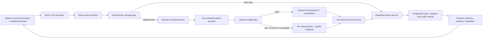

# Architecture and implementation narrative

## The architectural idea

HomeRounds is an agent around a state machine, not an agent instead of one. It separates five questions that are often collapsed in an AI health demo:

1. What did the patient explicitly confirm?
2. Does usable measurement evidence exist?
3. Which bounded workflow step is eligible and low burden?
4. What does the fictional, versioned protocol permit?
5. Was the next action actually persisted and owned?

That separation is the innovation and the safety boundary. Generative or provider output can improve the interaction, but it cannot manufacture an answer to any of those five questions.

## End-to-end implementation

### 1. Patient confirmation comes first

The patient route is [apps/web/src/app/(patient)/round/page.tsx](<../../apps/web/src/app/(patient)/round/page.tsx>), rendered by [patient-round-app.ts](../../apps/web/src/features/patient/patient-round-app.ts). The page requires:

- an explicit synthetic-demo acknowledgement;
- three structured red-flag answers;
- structured weakness and palpitation answers;
- confirmed check-in text before report submission;
- separate camera consent before capture;
- separate confirmation before creating a synthetic review task.

The voice panel states that voice and typed narrative are untrusted drafts. [voice-interaction-panel.ts](../../apps/web/src/features/voice/voice-interaction-panel.ts) keeps tentative/final transcript presentation separate from confirmation. The complete no-key behavior comes from the disabled/text providers in [packages/voice/src/providers.ts](../../packages/voice/src/providers.ts).

The optional ElevenLabs implementation in [elevenlabs-adapter.ts](../../apps/web/src/features/voice/elevenlabs-adapter.ts) uses WebRTC presentation events, bounded session timing, reconnect/error handling, and a short-lived credential fetched through the server route at [apps/web/src/app/api/providers/elevenlabs/session/route.ts](../../apps/web/src/app/api/providers/elevenlabs/session/route.ts). Its provider output does not expose workflow transitions such as urgency or action execution.

**Evidence state:** text is implemented and tested end to end. The ElevenLabs adapter and credential boundary are implemented and tested with fake transports; a live account/session remains pending.

### 2. The state machine owns episode authority

[packages/domain/src/round-reducer.ts](../../packages/domain/src/round-reducer.ts) defines explicit round states and transitions. The server orchestration in [apps/web/src/server/orchestration.ts](../../apps/web/src/server/orchestration.ts) coordinates report submission, assessment sessions, protocol evaluation, and actions through schema-validated services.

The state is not reconstructed from model prose. Refresh recovery restores persisted round/task state but intentionally does not reuse ephemeral camera or transcript state.

**Evidence state:** implemented, unit/integration tested, and exercised in patient/clinician browser journeys.

### 3. The planner selects one bounded next module

[packages/planner/src/index.ts](../../packages/planner/src/index.ts) scores only registered candidates using information gain, reliability, burden cost, availability, remaining burden, and the one-follow-up budget. Its deterministic sort and tie-break rules return one module or none.

[packages/assessments/src/registry.ts](../../packages/assessments/src/registry.ts) normalizes the provider registry. The server selects exactly one patient-visible optical provider for an assessment session. The patient page cannot change it, and the workflow does not silently substitute a different provider after failure.

**Evidence state:** implemented and tested with both provider fixtures. The planner is not a model call.

### 4. Optical evidence exists only after quality passes

Both adapters implement the shared contracts in [packages/contracts/src/assessment.ts](../../packages/contracts/src/assessment.ts).

#### Local finger PPG

[packages/assessments/providers/finger-ppg/provider.ts](../../packages/assessments/providers/finger-ppg/provider.ts) opens the rear camera, collects derived samples, applies deterministic signal analysis, and normalizes either a passing measurement or an explicit failure/unavailable result. [signal.ts](../../packages/assessments/providers/finger-ppg/signal.ts) checks duration, cadence, dropped frames, coverage, saturation, motion, signal strength, plausible range, and estimator agreement. Raw frames and time-series buffers are outside the result/API contract.

The implemented provider path processes locally and sends no camera frames. A later ordinary HomeRounds API call can submit only the normalized result/quality evidence.

#### Optional VitalLens

[packages/assessments/providers/vitallens/provider.ts](../../packages/assessments/providers/vitallens/provider.ts) requires configuration, explicit consent, a bounded 40×40 payload, maximum size/duration, a fixed HomeRounds proxy, timeout, strict response normalization, and typed unavailability. The server proxy is [apps/web/src/app/api/providers/vitallens/proxy/route.ts](../../apps/web/src/app/api/providers/vitallens/proxy/route.ts). The API key remains server-only.

VitalLens is not an on-device path. It changes the data boundary because low-resolution frames transit the HomeRounds server and third-party provider. Its live provider/privacy/account gate remains pending.

#### Quality abstention

The protocol input in [packages/protocols/src/evaluator.ts](../../packages/protocols/src/evaluator.ts) represents missing, unknown, conflicting, quality-failed, and present measurement states separately. Only `present` carries a `MeasurementFact`. A quality failure can be persisted as raw-media-free quality evidence and routed to review without a numeric fact.

**Evidence state:** both adapters and abstention are implemented and fixture-tested. The no-measurement patient-to-clinician branch is covered by separate automated browser/integration suites. Passing physical iPhone behavior and live comparative results are pending.

### 5. Red flags, protocol, and actions are deterministic

The fictional protocol is [data/protocols/cardiometabolic-demo.v1.json](../../data/protocols/cardiometabolic-demo.v1.json). It is explicitly labelled `illustrative_demo_only`, limits follow-up to one question, and orders red flags before data quality and ordinary decisions.

[packages/protocols/src/evaluator.ts](../../packages/protocols/src/evaluator.ts) evaluates stages in the fixed order `red_flag`, `data_quality`, then `decision`. It preserves unknown/missing/conflicting evidence and returns only schema-valid protocol outcomes. The “yes” red-flag branch returns demo emergency guidance before optical capture; uncertain red-flag answers abstain for review rather than becoming “no.”

[packages/actions/src/service.ts](../../packages/actions/src/service.ts) accepts only allowed actions from a protocol result, derives stable idempotency keys, and delegates atomic writes to the repository. Patient-facing wording is neutral—`programme review requested`—and any service window is visibly demo-only.

**Evidence state:** implemented and covered by protocol adversarial, action safety, contract, integration, and browser tests. The protocol is not clinical guidance and has no clinical validation.

### 6. PostgreSQL carries the closed loop

[packages/persistence/src/postgres/repository.ts](../../packages/persistence/src/postgres/repository.ts) and [0001_homerounds_foundations.sql](../../infra/db/migrations/0001_homerounds_foundations.sql) persist rounds, facts, assessments, protocol results, tasks, attempts, and audit events. Important behaviors include:

- transactions for state/action/audit effects that must agree;
- unique idempotency keys and duplicate suppression;
- expected-version checks and optimistic concurrency;
- ordinary update/delete rejection for audit events;
- recursive refusal of credential, transcript, and raw-media keys in standalone audit payloads;
- `raw_media_ref` constrained to remain null in the supported profile.

The clinician route is [apps/web/src/app/(clinician)/clinician/page.tsx](<../../apps/web/src/app/(clinician)/clinician/page.tsx>). [clinician-cockpit.tsx](../../apps/web/src/features/clinician/clinician-cockpit.tsx) scopes the queue to explicit round references. [evidence-chain.tsx](../../apps/web/src/features/clinician/evidence-chain.tsx) labels each source and keeps missing evidence visible. [action-panel.tsx](../../apps/web/src/features/clinician/action-panel.tsx) separates local intent from saved state and displays success only after a persistence receipt and audit reference return.

The supported closed-loop mutations are synthetic note save, acknowledgement, contact-attempt recording, and completion. Completion moves the persisted task/round state, which the patient route can fetch and display.

**Evidence state:** implemented and tested in memory, PostgreSQL, integration, and separate Playwright closed-loop suites. The final protected local production-build run separately proved readiness, seed/check, access controls, secure-cookie attributes, responsive/axe checks, and clean console/page behavior; it did not execute the full mutation loop.

## Runtime and trust boundaries

| Boundary                   | Implemented control                                                                                    | Important limitation                                                                                        |
| -------------------------- | ------------------------------------------------------------------------------------------------------ | ----------------------------------------------------------------------------------------------------------- |
| Browser → HomeRounds API   | Zod validation, exact-origin checks for mutations, role/synthetic-patient scope, bounded request sizes | Shared-code demo sessions are not real identity, MFA, tenancy, or production RBAC                           |
| Browser → ElevenLabs       | Server-issued short-lived WebRTC token; long-lived key stays server-side                               | Live account, retention, residency, privacy, and session evidence pending                                   |
| Browser → local finger PPG | In-browser derived-sample processing; no provider frame network path                                   | Physical device/browser/population performance not validated                                                |
| Browser → VitalLens        | Explicit consent, bounded payload, fixed server proxy, server-only key                                 | Third-party US processing boundary; live/privacy/account gate pending                                       |
| Application → PostgreSQL   | Transactions, idempotency, optimistic concurrency, append-only audit controls                          | Hosted Neon, backups, and restore evidence pending                                                          |
| Public demo access         | Signed role-scoped Secure/HttpOnly/SameSite=Strict cookie and exact-origin shared-code exchange        | One shared synthetic-demo code and process-local throttling are not production authentication/abuse control |

## Three seeded scenarios

[data/demo/scenarios.v1.json](../../data/demo/scenarios.v1.json) defines three exact reset-safe scenarios:

1. `maya-happy-text`: complete no-key text flow with optional recorded synthetic recovery policy.
2. `maya-poor-quality`: quality failure/retry and no-measurement review path.
3. `maya-red-flag`: structured red-flag hard stop; optical capture must not start.

[scripts/demo/reset.mjs](../../scripts/demo/reset.mjs) deletes and reseeds only those exact trigger IDs, refuses production, requires demo mode and a database URL, and never truncates the database.

## What is not implemented or not proved

- No real eMed, EHR, SMART on FHIR, medication, pharmacy, scheduling, or patient-identity integration.
- No clinical threshold, diagnosis, treatment, medication-change, emergency-monitoring, or health-outcome claim.
- No real patient data, real clinical owner, real response SLA, or production tenancy.
- No hosted Vercel/Neon observation at this base.
- No physical iPhone/Safari permission, torch, optical, thermal, or background evidence.
- No live ElevenLabs or VitalLens evidence.
- No physical comparison between the two optical methods and no accuracy/comparative claim.
- No complete centralized logging/metrics/alerting, SIEM, WAF, CSP, SBOM/signing, penetration test, DPIA, QMS, or clinical safety case.
- No current external dependency-advisory result for the candidate; the privacy-approved manual route remains pending.

## Production path

The repository is production-shaped, not production-ready. [planning/05_PRODUCTION_ROADMAP.md](../../planning/05_PRODUCTION_ROADMAP.md) requires evidence-gated phases: internal technical controls, clinical shadow mode, clinician-in-the-loop pilot, and only then a controlled regulated deployment. Real use requires an explicit intended purpose/population, clinical and regulatory review, identity/tenancy/consent, validated device and subgroup performance, real integration provenance, operational ownership/SLA, security/privacy approval, recovery evidence, and human-factors evaluation.
