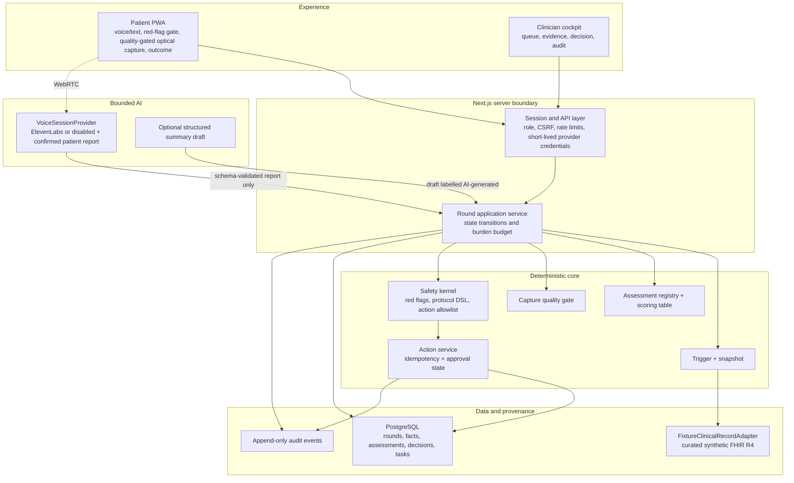

# HomeRounds technical architecture and decisions

## 1. Architecture objective

Build the hackathon as a real, auditable vertical slice whose boundaries can survive productionisation. “Production-grade” here means explicit contracts, deterministic safety logic, transactional actions, provenance, privacy-by-default, observable failure states, and replaceable adapters. It does **not** mean the hackathon prototype is clinically validated or deployable to real patients.

## 2. Reference architecture



### Trust boundaries

1. Browser input, model output, FHIR fixtures, and protocol files are untrusted until validated.
2. The browser never receives a long-lived ElevenLabs/VitalLens/model-provider key or direct database credentials.
3. The voice provider can propose a strict patient report that remains untrusted until schema validation and patient confirmation. It cannot directly set state, urgency, protocol facts, or action type.
4. Every state-changing endpoint checks the current round state and idempotency key inside one transaction.
5. A quality failure cannot be converted to a numeric assessment by UI, model, or protocol code.
6. Raw camera frames are never persisted. Local finger PPG keeps them in device memory only; a selected VitalLens path may transmit only the documented cropped/downsampled inference payload through the server proxy and discards it after inference.

## 3. Architecture decision records

### ADR-001 — Web PWA before native apps

**Decision:** one mobile-first Next.js application with `/patient` and `/clinician` routes.  
**Why:** fastest route to a live phone experience and second browser interface; avoids App Store/TestFlight and duplicate native stacks.  
**Consequence:** camera and microphone require a secure context; physical phone compatibility must be tested early. Xcode Simulator does not validate a real rear camera, torch, or PPG signal and is not an MVP acceptance surface.  
**Production path:** keep domain packages portable; introduce native shells only when HealthKit/Health Connect, stronger device control, or validated on-device processing justifies them.

### ADR-002 — One monorepo, one deployable app, explicit packages

**Decision:** pnpm workspace plus Turborepo, with one Next.js app and domain packages.  
**Why:** shared schemas without copying, fast parallel tests, clear worktree ownership, and one deployment.  
**Constraint:** the integration task exclusively owns root package/config files and the lockfile. Workers do not install dependencies.

### ADR-003 — Agent around a state machine

**Decision:** an exhaustive TypeScript state transition function owns each round.  
**Why:** the model must not control clinical episode state or stop conditions.  
**Shape:** discriminated-union states and events, optimistic version on the round row, and invalid-transition rejection.

Recommended states:

```text
invited
  -> red_flag_screen
  -> collecting_report
  -> assessment_selected
  -> capturing
  -> capture_retry | assessment_complete
  -> follow_up_selected | protocol_ready
  -> protocol_decided
  -> action_pending
  -> awaiting_clinician | outcome_ready
  -> closed

Any active state -> emergency_closed | abstained_for_review | patient_declined
```

### ADR-004 — Two optical implementations, one release-selected provider

**Decision:** implement `finger_ppg_hr_v1` and `vitallens_face_rppg_v1` behind the same normalized assessment contract. Keep local finger PPG as the no-key default. A release configuration selects exactly one patient-visible provider after physical-iPhone comparison; there is no automatic cross-provider fallback inside a round.  
**Decision gate:** each provider must pass its own fixture/quality suite. Physical acceptance still requires three rehearsed captures on the iPhone 12. VitalLens additionally requires a server proxy, explicit consent, an accepted downsampled-frame boundary, and a live account/key; without those, its adapter reports `unavailable` and local PPG/text/manual evidence remains usable.  
**Why:** parallel implementation lets us empirically compare ergonomics and reliability without coupling the product to either vendor. One active provider preserves a simple patient flow, honest provenance, and deterministic quality semantics. MediaPipe still adds no value to finger PPG and is not added independently.  
**Claim:** demonstration heart-rate estimate with quality evidence, not ECG, arrhythmia detection, oxygen saturation, blood pressure, respiratory diagnosis, HRV interpretation, or clinical validation.

### ADR-005 — Structured question is the only follow-up module

**Decision:** `palpitation_context_v1` is a deterministic questionnaire selected by the scoring table.  
**Why:** it proves adaptive sequencing without a second fragile sensor or OCR dependency.  
**Constraint:** fixed schema and approved wording; at most one follow-up in the hero round.

### ADR-006 — PostgreSQL for both local and hosted profiles

**Decision:** PostgreSQL with Drizzle and a repository layer. Use a local container for the primary demo and managed PostgreSQL for the hosted HTTPS backup.  
**Why:** SQLite is reliable locally but incompatible with durable writes on typical Vercel serverless deployment. A single SQL dialect reduces divergence.  
**Constraint:** one lane owns schema/migrations; action creation and audit append occur in the same transaction.  
**Fallback:** if Docker or managed DB access is impossible, a deterministic in-memory repository is permitted only for recorded fallback and automated tests, visibly labelled and never presented as a persisted live action.

### ADR-007 — Curated synthetic FHIR fixture, not live Synthea generation

**Decision:** check in one small, valid, curated FHIR R4 bundle derived from or shaped like a Synthea export, behind `ClinicalRecordAdapter`.  
**Why:** runtime generation and large bundles add no judge value. The app needs stable longitudinal facts with source references.  
**Constraint:** visible “synthetic patient” badge; no real patient or participant data in fixtures.

### ADR-008 — Small JSON protocol DSL

**Decision:** versioned JSON validated by Zod and evaluated by a pure, closed set of predicates. Do not evaluate code, prompts, JSONLogic extensions, or arbitrary expressions.  
**Supported predicates:** `all`, `any`, `fact`, `eq`, `in`, `gt`, `gte`, `lt`, `lte`, `exists`.  
**Why:** deterministic, reviewable, testable, and safe within the time limit.  
**Constraint:** protocol files carry `demo-only`, population, exclusions, clinical owner, review date, rules, allowed actions, and patient-message template IDs.

### ADR-009 — Provider-neutral voice with ElevenLabs primary and text authority

**Decision:** define a `VoiceSessionProvider` contract and make ElevenLabs ElevenAgents over WebRTC the hosted hackathon implementation. An authenticated server endpoint issues the short-lived conversation token/signed credential; no long-lived provider key reaches the browser. A `disabled` adapter and deterministic transcript fixtures are first-class implementations.  
**Why:** the owner has ElevenLabs credit, its React SDK supports WebRTC voice, text-only sessions, live transcripts, and authenticated client sessions, and its free tier currently includes limited call minutes. Building a fully self-hosted STT/LLM/TTS/WebRTC stack would add operational and latency risk during the hackathon.  
**Tool surface:** voice proposes only schema-valid patient-report fields or narration acknowledgements. The application owns phase, required questions, confirmation, red flags, urgency, and actions.  
**Fallback:** the complete interaction is keyboard/touch accessible; transcripts are visible and editable before confirmation; no voice-only business logic. OpenAI Realtime and a self-hosted LiveKit/whisper.cpp/Piper stack remain later adapters, not Checkpoint dependencies.

### ADR-010 — No raw media retention; explicit provider boundary

**Decision:** store measurement, algorithm/provider version, duration, device/browser metadata, quality score, reasons, and optionally a derived waveform. `rawMediaRef` is always null. Local finger PPG processes frames in browser memory and sends none. If VitalLens is selected, only its documented cropped/downsampled inference payload may cross the network through our backend proxy; no video is persisted by HomeRounds.  
**Why:** minimum necessary data, honest data-flow disclosure, and fewer privacy/security failure modes.

### ADR-011 — Hosted HTTPS primary phone path, local recovery path

**Decision:** the rehearsed phone flow uses a hosted HTTPS deployment because `getUserMedia` is a secure-context API. The laptop also runs a complete local deployment with local PostgreSQL.  
**Recovery options:** phone hotspot plus hosted site; Android USB `localhost` path if available; locally trusted HTTPS only if installed and tested before the event.  
**Do not assume:** that `http://<laptop-ip>:3000` will expose camera/microphone on a phone.

### ADR-012 — Production observability is internal-first

**Decision:** record structured application audit events in PostgreSQL and standard logs with redaction. Treat provider agent tracing as synthetic-development-only unless contractual retention/residency is confirmed.  
**Why:** OpenAI’s current data-control documentation says default API abuse logs may retain customer content for up to 30 days, and notes limitations for Realtime tracing and EU data residency. Real PHI needs the appropriate healthcare agreement, eligible endpoints, and organisation configuration.

## 4. Recommended stack

Versions are resolved and pinned in Checkpoint 0 from current stable releases; do not use floating ranges after the lockfile is committed.

| Layer                        | Hackathon choice                                                                                         | Version policy                                                               | Production note                                                                                   |
| ---------------------------- | -------------------------------------------------------------------------------------------------------- | ---------------------------------------------------------------------------- | ------------------------------------------------------------------------------------------------- |
| Runtime                      | Node.js 22.22.2 for the verified hackathon toolchain                                                     | pin `.nvmrc` and engine range; retest Node 24 after the event                | Node 24 is the preferred production LTS, but the available Mac runtime is the executable baseline |
| Monorepo                     | pnpm + Turborepo                                                                                         | pin pnpm via `packageManager`                                                | remote cache optional, not demo-critical                                                          |
| Web                          | latest stable Next.js 16 + React 19 + strict TypeScript                                                  | scaffold latest stable, record resolved versions, lock                       | Node server/container deployment supports full features                                           |
| Styling/UI                   | Tailwind CSS 4; Radix/shadcn primitives; Lucide icons                                                    | add components intentionally, no bulk library                                | internal design system and WCAG 2.2 AA evidence later                                             |
| Validation                   | Zod                                                                                                      | one schema package imported everywhere                                       | AI/tool/protocol/API/event boundaries all validated                                               |
| Voice                        | `@elevenlabs/react` ElevenAgents SDK behind `VoiceSessionProvider`                                       | pin resolved SDK; authenticated WebRTC; `disabled` provider always available | provider/data agreement, regional processing, evaluation and cost controls before real data       |
| Optional narrative synthesis | deterministic templates first; model gateway only if it materially improves the evidence card            | strict schema, evidence IDs, disabled by default                             | provider choice is independent of the voice transport                                             |
| Database                     | PostgreSQL 17 + Drizzle                                                                                  | migrations committed, one owner                                              | managed regional PostgreSQL and stronger role policy later                                        |
| FHIR                         | minimal R4 types + `ClinicalRecordAdapter`                                                               | no live server in MVP                                                        | SMART App Launch/Medplum/eMed adapters later                                                      |
| Signal                       | local browser finger PPG plus server-proxied `vitallens`, normalized behind one release-selected adapter | provider/version pinned; no external clinical claim                          | validated implementation/device matrix after study                                                |
| Unit/integration             | Vitest + property tests where useful                                                                     | deterministic clocks/IDs                                                     | protocol and state coverage are release gates                                                     |
| E2E                          | Playwright + `@axe-core/playwright`                                                                      | deterministic frame-source injection                                         | physical device suite remains separate                                                            |
| Quality                      | ESLint, TypeScript, Prettier or Biome, `git diff --check`, Lighthouse CI                                 | root-owned configuration                                                     | dependency/SBOM scans before pilot                                                                |
| Logging                      | structured JSON logger + audit repository                                                                | no sensitive content by default                                              | OpenTelemetry/SIEM with retention policy later                                                    |

### Deliberately not selected for the MVP

- MediaPipe as a standalone dependency: unnecessary for finger PPG and duplicative if the selected VitalLens client handles its own face ROI.
- XState: plain exhaustive transitions are smaller and easier to audit in this slice.
- Temporal: durable workflows are a production checkpoint, not a 20-hour dependency.
- Medplum: the adapter boundary matters; a live FHIR server does not improve the core demo.
- Supabase auth/RLS: useful production direction, but synthetic demo roles do not justify the setup cost.
- rPPG-Toolbox/openSMILE/CQL execution: license, runtime, or scope risk without demo-critical value.

## 5. Suggested repository structure

```text
apps/
  web/
    src/app/
      patient/
      clinician/
      api/
    src/features/
      patient/
      clinician/
      realtime/
      workflows/
    src/server/
packages/
  contracts/          # frozen cross-lane Zod schemas and enums
  domain/             # round transition model
  persistence/        # repositories and transactions
  clinical-records/   # adapter and fixture implementation
  planner/            # deterministic module eligibility and scoring
  assessments/        # registry, normalized quality gate, isolated optical providers
  protocols/          # protocol schema and pure evaluator
  actions/            # task/message/follow-up allowlist and idempotency
  voice/              # provider contract, ElevenLabs/disabled adapters, transcript schemas
  audit/               # immutable event contracts and redaction
  api-client/          # typed browser client
  ui/                  # tokens, primitives, shared components
data/
  fhir/
  demo/
  protocols/
infra/
  db/
  deploy/
scripts/
tests/
  unit/
  integration/
  contract/
  e2e/patient/
  e2e/clinician/
  accessibility/
docs/
  safety/
  operations/
  submission/
```

## 6. Core contracts

### Round aggregate

```ts
type Round = {
  id: string;
  patientId: string;
  state: RoundState;
  stateVersion: number;
  purpose: string;
  triggerId: string;
  burdenSecondsRemaining: number;
  protocolId: string;
  createdAt: string;
  updatedAt: string;
  closedAt: string | null;
};
```

### Material entities

```text
patient_snapshot      source-grounded projection of fixture FHIR
round                  current aggregate and optimistic version
round_trigger          signal combination and promotion/suppression reason
round_fact             typed value, source kind/ref, observed time
assessment_definition versioned registry entry
assessment_session     requested/start/end/device/attempt state
assessment_result      measurements and module metadata
capture_quality        status, score, metrics, failure reasons
protocol_definition    immutable version and owner metadata
protocol_decision      matched rules, urgency, allowed actions, missing facts
care_action            idempotency key, class, status, SLA, owner
approval               requested/resolved actor and decision
evidence_reference     source pointer and display label
audit_event            append-only actor/event/version/payload
```

### Action idempotency

Create a unique database constraint over:

```text
(round_id, action_type, idempotency_key)
```

The endpoint returns the existing action on a repeated request with the same key. It rejects a reused key with incompatible input. The action row and audit event commit in one transaction.

### Event envelope

```ts
const DomainEventSchema = z.object({
  eventId: z.string().uuid(),
  type: DomainEventTypeSchema,
  schemaVersion: z.literal(1),
  occurredAt: z.string().datetime(),
  actor: ActorSchema,
  patientId: z.string(),
  roundId: z.string().uuid(),
  source: z.enum(["patient_ui", "clinician_ui", "system", "agent_tool"]),
  payload: z.unknown()
});
```

## 7. Optical assessment-provider design

### Local finger-PPG path

1. Confirm secure context and camera API.
2. Request rear camera using a soft `facingMode: environment` preference.
3. Inspect capabilities. Enable torch only when capability exists and `applyConstraints` succeeds; never make torch a required constraint.
4. Draw a stable central region of interest to an offscreen canvas or consume video frames.
5. Calculate frame timestamp, mean RGB, saturation fraction, coverage proxy, and motion/change metrics.
6. Keep only derived samples in a circular buffer; never upload frames.
7. After stable coverage, collect at least the configured valid duration.
8. Detrend and band-pass a physiologically plausible **signal-processing** band.
9. Estimate periodicity with two methods, such as FFT peak and autocorrelation/peak intervals.
10. Produce a numeric value only if coverage, illumination, cadence, duration, signal-to-noise, and estimator agreement pass.
11. Stop all camera tracks on result, cancel, route change, page hide, or error.

### VitalLens face-rPPG path

1. Request the front camera after explicit synthetic-demo biometric/health-data consent.
2. Use the official `vitallens` JavaScript client but point it to a HomeRounds server proxy; never embed the provider API key in the browser.
3. Let the client crop/downsample the face video to the provider's documented low-resolution payload and remove audio.
4. Apply authentication, origin/rate limits, payload limits, timeout, provider-version pinning, and redacted logging at the proxy.
5. Treat provider HTTP success as transport success only. Emit a measurement fact only when provider processing/quality status passes our registered threshold.
6. Store derived result, quality, provider/model version and provenance; store no face frames or video.
7. Stop media tracks and provider streaming on completion, cancellation, navigation, page hide, timeout, or error.
8. Show an unavailable/retry state on provider/network failure and preserve the deterministic text workflow.

This path changes the privacy architecture: documented downsampled face frames transit a third-party US-hosted API. It is permitted for the synthetic hackathon demo only after owner acceptance and must not be described as all-on-device or clinical monitoring.

### Quality evidence

Quality should not be a decorative percentage. Store named metrics and failure reasons:

- coverage stability;
- clipped/saturated-frame ratio;
- dark-frame ratio;
- frame cadence and dropped-frame ratio;
- motion/ROI discontinuity;
- usable duration;
- band-power ratio or periodicity confidence;
- agreement between estimators;
- supported device/browser metadata.

Status is `pass`, `retry`, or `fail`, normalized across the selected provider. The protocol accepts only `pass` results. One coached retry is allowed; repeated failure produces an abstention review.

### Evidence caveat

For local finger PPG, the cited prospective validation study used proprietary algorithms, a Pixel 3, a controlled protocol, and did not publish the raw implementation. Its results support feasibility, not equivalence. For VitalLens, the provider itself labels the API general-wellness only and not intended for medical monitoring. HomeRounds must never transfer either source's accuracy or intended-use claims to this implementation.

## 8. Protocol and planner design

### Planner

The planner is a pure function:

```text
eligible modules
  = registry entries
  filtered by state, device, exclusion, already-attempted, and pathway permission

score
  = action relevance
  + expected information gain
  + reliability
  - patient burden
  - known capture failure risk
  - clinical misuse risk
```

All terms are a small explicit integer table checked into source. Tie-breaking is deterministic. The output is exactly one module or `abstain`.

### Safety ordering

```text
receive structured fact
  -> validate source and type
  -> run red flags
  -> enforce capture-quality gate where relevant
  -> update known/unknown fact set
  -> select one next module or stop
  -> evaluate versioned protocol
  -> intersect requested actions with allowlist
  -> enforce approval policy
  -> execute idempotently
  -> produce approved/template-bounded patient message
```

Red flags run at round start, after every report/result, and before closure. Emergency guidance must not wait for a summary model.

## 9. Voice and optional model integration

### ElevenLabs session

- Browser requests a short-lived ElevenLabs conversation token/signed credential from an authenticated server-only endpoint.
- Server authenticates with `ELEVENLABS_API_KEY`; the browser receives only the short-lived credential and configured agent identifier.
- Browser connects through `@elevenlabs/react`; voice uses WebRTC and the same provider can expose text-only conversation during diagnostics.
- The app, not the hosted agent, selects the current phase and permitted structured-report operation.
- Tentative and final transcript events remain presentation data until the user confirms the structured report.
- The UI displays captions, microphone state, an explicit AI label, cost/session timeout, and immediate text fallback.
- A missing key/agent, quota error, network failure, or denied microphone deterministically selects the `disabled` adapter without stranding the round.

### Provider configuration

```text
VOICE_PROVIDER=disabled|elevenlabs
ELEVENLABS_API_KEY=                 # server only
ELEVENLABS_AGENT_ID=
ELEVENLABS_SERVER_LOCATION=global
VOICE_SESSION_MAX_SECONDS=120
NARRATIVE_MODEL_PROVIDER=disabled   # optional and independent
```

Store provider, agent/config version, connection type, consent/permission outcome, duration, and failure category on relevant synthetic-demo audit events. Never store raw voice audio. The deterministic report schema and UI confirmation are portable across later ElevenLabs, OpenAI Realtime, LiveKit, or local adapters.

### Summary generation

Prefer deterministic templates for the patient outcome and evidence-card skeleton. If a model drafts narrative text:

- input is a bounded structured fact bundle;
- output has a strict schema and length limits;
- each statement maps to evidence IDs;
- unsupported statements are rejected;
- the card says “AI-generated draft; verify”;
- task creation does not depend on the narrative succeeding.

## 10. Security, privacy, and clinical-safety controls

### Hackathon profile

- synthetic data only and visible synthetic badge;
- demo password/session gate on public deployment;
- API key server-side only;
- same-site secure cookies and CSRF protection for state-changing browser requests;
- endpoint rate limits and request-size limits;
- Zod validation for API, model, tools, events, protocol, and fixtures;
- raw media off and camera stream cleanup;
- no secrets or patient-like text in logs;
- dependency audit and secret scan before submission;
- deterministic emergency guidance always reachable;
- fictional protocol labelled and not represented as medical guidance.

### Production additions

- OIDC/OAuth identity, RBAC/ABAC, purpose-of-use, consent, and break-glass controls;
- UK/EU regional data stores, key management, encrypted backups, disaster recovery;
- DCB0129 clinical safety case and hazard log; deployment-side DCB0160 work;
- DPIA, retention schedule, records of processing, vendor/processor agreements;
- medical-device qualification/classification and intended-purpose review;
- signed protocol releases, clinical owner approval, expiry, rollback, and change control;
- SIEM, incident response, vulnerability management, penetration testing, SBOM;
- validated device/subgroup support matrix and post-market monitoring;
- acknowledgement/SLA/escalation for every clinical task.

## 11. Deployment profiles

### `demo-local`

- Next.js Node server on the laptop;
- local PostgreSQL container;
- deterministic fixture and reset;
- text fallback works without any voice/model provider;
- Android USB/localhost or locally trusted HTTPS only if rehearsed;
- physical iPhone normally uses the hosted HTTPS profile, not the laptop LAN URL;
- no external tracing.

### `demo-hosted`

- hosted HTTPS Next.js deployment;
- managed PostgreSQL;
- protected demo session;
- ElevenLabs voice enabled when configured; no-key mode remains deployable;
- same seed/reset and idempotency tests;
- synthetic data only.

### `recorded-fallback`

- screen recording of a previously successful real end-to-end run;
- labelled replay of a prior valid real selected-sensor capture if live capture fails;
- never substitute an unlabeled fixture value for a live measurement.

## 12. Environment configuration

```text
APP_ENV=development|demo|production
APP_BASE_URL=
DATABASE_URL=
DEMO_MODE=true
DEMO_ACCESS_SECRET=
FHIR_PROVIDER=fixture
VOICE_PROVIDER=disabled|elevenlabs
ELEVENLABS_API_KEY=
ELEVENLABS_AGENT_ID=
ELEVENLABS_SERVER_LOCATION=global
VOICE_SESSION_MAX_SECONDS=120
NARRATIVE_MODEL_PROVIDER=disabled
OPTICAL_ASSESSMENT_PROVIDER=finger_ppg|vitallens
VITALLENS_API_KEY=                 # server-only; adapter reports unavailable if absent
VITALLENS_PROXY_ENABLED=false
STORE_RAW_MEDIA=false
ENABLE_PROVIDER_TRACING=false
LOG_LEVEL=info
```

Environment parsing is strict at process start. Production must fail closed if `DEMO_MODE=true`, `STORE_RAW_MEDIA=true` without an approved retention configuration, a fixture FHIR provider is selected unintentionally, or VitalLens is selected without the server proxy/key and explicit data-flow configuration.

## 13. Architecture acceptance

- no application code parses free text to determine urgency or action;
- no quality-failed assessment can be read by the protocol as a measurement;
- every state change is a valid transition and audited;
- every clinician action is idempotent and has ownership/SLA fields;
- patient and clinician surfaces read the same persisted round state;
- a model outage cannot corrupt or strand the round;
- secure-context/device incompatibility is detected before capture begins;
- raw video is absent from database, logs, and storage; local finger PPG sends no frames, while a selected VitalLens path exposes only its documented downsampled proxied inference payload in network traces;
- demo and production configurations cannot be confused silently.
